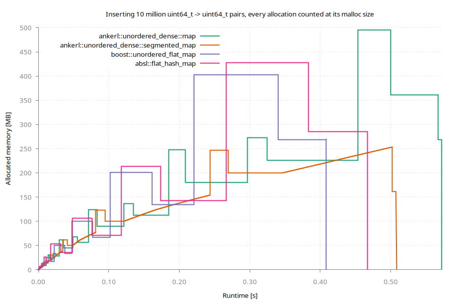

<a id="top"></a>

[](https://github.com/martinus/unordered_dense/releases)
[](https://raw.githubusercontent.com/martinus/unordered_dense/main/LICENSE)
[](https://github.com/martinus/unordered_dense/actions)
[](https://bestpractices.coreinfrastructure.org/projects/6220)
[](https://github.com/sponsors/martinus)

# 🚀 ankerl::unordered_dense::{map, set} <!-- omit in toc -->

A fast & densely stored hashmap and hashset based on robin-hood backward shift deletion for C++17 and later.

The classes `ankerl::unordered_dense::map` and `ankerl::unordered_dense::set` are (almost) drop-in replacements of `std::unordered_map` and `std::unordered_set`. While they don't have as strong iterator / reference stability guarantees, they are typically *much* faster.

Additionally, there are `ankerl::unordered_dense::segmented_map` and `ankerl::unordered_dense::segmented_set` with lower peak memory usage, and stable references (iterators are NOT stable) on insert.

- [1. Overview](#1-overview)
- [2. Installation](#2-installation)
  - [2.1. Installing using cmake](#21-installing-using-cmake)
- [3. Usage](#3-usage)
  - [3.1. Modules](#31-modules)
  - [3.2. Hash](#32-hash)
    - [3.2.1. Simple Hash](#321-simple-hash)
    - [3.2.2. High Quality Hash](#322-high-quality-hash)
    - [3.2.3. Specialize `ankerl::unordered_dense::hash`](#323-specialize-ankerlunordered_densehash)
    - [3.2.4. Heterogeneous Overloads using `is_transparent`](#324-heterogeneous-overloads-using-is_transparent)
    - [3.2.5. Automatic Fallback to `std::hash`](#325-automatic-fallback-to-stdhash)
    - [3.2.6. Hash the Whole Memory](#326-hash-the-whole-memory)
  - [3.3. Container API](#33-container-api)
    - [3.3.1. `auto replace_key(iterator it, K&& new_key) -> std::pair<iterator, bool>`](#331-auto-replace_keyiterator-it-k-new_key---stdpairiterator-bool)
    - [3.3.2. `auto extract() && -> value_container_type`](#332-auto-extract----value_container_type)
    - [3.3.3. `extract()` Single Elements](#333-extract-single-elements)
    - [3.3.4. `[[nodiscard]] auto values() const noexcept -> value_container_type const&`](#334-nodiscard-auto-values-const-noexcept---value_container_type-const)
    - [3.3.5. `auto replace(value_container_type&& container)`](#335-auto-replacevalue_container_type-container)
    - [3.3.6. `auto hash_for(K const& key) const -> precomputed_hash`](#336-auto-hash_fork-const-key-const---precomputed_hash)
  - [3.4. Custom Container Types](#34-custom-container-types)
  - [3.5. Custom Bucket Types](#35-custom-bucket-types)
    - [3.5.1. `ankerl::unordered_dense::bucket_type::standard`](#351-ankerlunordered_densebucket_typestandard)
    - [3.5.2. `ankerl::unordered_dense::bucket_type::big`](#352-ankerlunordered_densebucket_typebig)
- [4. `segmented_map` and `segmented_set`](#4-segmented_map-and-segmented_set)
- [5. Design](#5-design)
  - [5.1. Inserts](#51-inserts)
  - [5.2. Lookups](#52-lookups)
  - [5.3. Removals](#53-removals)
- [6. Real World Usage](#6-real-world-usage)
  - [6.1. Databases and data engines](#61-databases-and-data-engines)
  - [6.2. Games, emulators and game engines](#62-games-emulators-and-game-engines)
  - [6.3. Graphics, rendering and GPU compute](#63-graphics-rendering-and-gpu-compute)
  - [6.4. Maps and geospatial](#64-maps-and-geospatial)
  - [6.5. CAD, 3D printing and simulation](#65-cad-3d-printing-and-simulation)
  - [6.6. Bioinformatics](#66-bioinformatics)
  - [6.7. Networking, media and security](#67-networking-media-and-security)
  - [6.8. Finance and blockchain](#68-finance-and-blockchain)
  - [6.9. Tools, libraries and machine learning](#69-tools-libraries-and-machine-learning)
  - [6.10. Ports](#610-ports)

## 1. Overview

The chosen design has a few advantages over `std::unordered_map`: 

* Perfect iteration speed - Data is stored in a `std::vector`, all data is contiguous!
* Very fast insertion & lookup speed, in the same ballpark as [`absl::flat_hash_map`](https://abseil.io/docs/cpp/guides/container`)
* Low memory usage
* Full support for `std::allocators`, and [polymorphic allocators](https://en.cppreference.com/w/cpp/memory/polymorphic_allocator). There are `ankerl::unordered_dense::pmr` typedefs available
* Customizable storage type: with a template parameter you can e.g. switch from `std::vector` to `boost::interprocess::vector` or any other compatible random-access container.
* Better debugging: the underlying data can be easily seen in any debugger that can show an `std::vector`.

There's no free lunch, so there are a few disadvantages:

* Deletion speed is relatively slow. This needs two lookups: one for the element to delete, and one for the element that is moved onto the newly empty spot.
* no `const Key` in `std::pair<Key, Value>`
* Iterators and references are not stable on insert or erase.

## 2. Installation

<!-- See https://github.com/bernedom/SI/blob/main/doc/installation-guide.md -->
The default installation location is `/usr/local`.

### 2.1. Installing using cmake 

Clone the repository and run these commands in the cloned folder:

```sh
mkdir build && cd build
cmake ..
cmake --build . --target install
```

Consider setting an install prefix if you do not want to install `unordered_dense` system wide, like so:

```sh
mkdir build && cd build
cmake -DCMAKE_INSTALL_PREFIX:PATH=${HOME}/unordered_dense_install ..
cmake --build . --target install
```

To make use of the installed library, add this to your project:

```cmake
find_package(unordered_dense CONFIG REQUIRED)
target_link_libraries(your_project_name unordered_dense::unordered_dense)
```

## 3. Usage

### 3.1. Modules

`ankerl::unordered_dense` supports c++20 modules. Simply compile `src/ankerl.unordered_dense.cpp` and use the resulting module, e.g. like so:

```sh
clang++ -std=c++20 -I include --precompile -x c++-module src/ankerl.unordered_dense.cpp
clang++ -std=c++20 -c ankerl.unordered_dense.pcm
```

To use the module, for example in `module_test.cpp`, use 

```cpp
import ankerl.unordered_dense;
```

and compile with e.g.

```sh
clang++ -std=c++20 -fprebuilt-module-path=. ankerl.unordered_dense.o module_test.cpp -o main
```

A simple demo script can be found in `test/modules`.

### 3.2. Hash

`ankerl::unordered_dense::hash` is a fast and high quality hash, based on [wyhash](https://github.com/wangyi-fudan/wyhash). The `ankerl::unordered_dense` map/set differentiates between high quality hashes (good [avalanching effect](https://en.wikipedia.org/wiki/Avalanche_effect)) and low quality hashes. High quality hashes contain a special marker:

```cpp
using is_avalanching = void;
```

This is the case for the specializations `bool`, `char`, `signed char`, `unsigned char`, `char8_t`, `char16_t`, `char32_t`, `wchar_t`, `short`, `unsigned short`, `int`, `unsigned int`, `long`, `long long`, `unsigned long`, `unsigned long long`, `T*`, `std::unique_ptr<T>`, `std::shared_ptr<T>`, `enum`, `std::basic_string<C>`, and `std::basic_string_view<C>`.

Hashes that do not contain this marker are assumed to be of low quality and receive an additional mixing step inside the map/set implementation.

#### 3.2.1. Simple Hash

Consider a simple custom key type:

```cpp
struct id {
    uint64_t value{};

    auto operator==(id const& other) const -> bool {
        return value == other.value;
    }
};
```

The simplest implementation of a hash is this:

```cpp
struct custom_hash_simple {
    auto operator()(id const& x) const noexcept -> uint64_t {
        return x.value;
    }
};
```
This can be used, for example, with 

```cpp
auto ids = ankerl::unordered_dense::set<id, custom_hash_simple>();
```

Since `custom_hash_simple` doesn't have a `using is_avalanching = void;` marker, it is considered to be of low quality and additional mixing of `x.value` is automatically provided inside the set.

#### 3.2.2. High Quality Hash

Back to the `id` example, we can easily implement a higher quality hash:

```cpp
struct custom_hash_avalanching {
    using is_avalanching = void;

    auto operator()(id const& x) const noexcept -> uint64_t {
        return ankerl::unordered_dense::detail::wyhash::hash(x.value);
    }
};
```

We know `wyhash::hash` is of high quality, so we can add `using is_avalanching = void;` which makes the map/set directly use the returned value.


#### 3.2.3. Specialize `ankerl::unordered_dense::hash`

Instead of creating a new class you can also specialize `ankerl::unordered_dense::hash`:

```cpp
template <>
struct ankerl::unordered_dense::hash<id> {
    using is_avalanching = void;

    [[nodiscard]] auto operator()(id const& x) const noexcept -> uint64_t {
        return detail::wyhash::hash(x.value);
    }
};
```

#### 3.2.4. Heterogeneous Overloads using `is_transparent`

This map/set supports heterogeneous overloads as described in [P2363 Extending associative containers with the remaining heterogeneous overloads](https://www.open-std.org/jtc1/sc22/wg21/docs/papers/2022/p2363r3.html) which is [targeted for C++26](https://wg21.link/p2077r2). This has overloads for `find`, `count`, `contains`, `equal_range` (see [P0919R3](https://www.open-std.org/jtc1/sc22/wg21/docs/papers/2018/p0919r3.html)), `erase` (see [P2077R2](https://www.open-std.org/jtc1/sc22/wg21/docs/papers/2020/p2077r2.html)), and  `try_emplace`, `insert_or_assign`, `operator[]`, `at`, and `insert` & `emplace` for sets (see [P2363R3](https://www.open-std.org/jtc1/sc22/wg21/docs/papers/2022/p2363r3.html)).

For heterogeneous overloads to take effect, both `hasher` and `key_equal` need to have the attribute `is_transparent` set.

Here is an example implementation that's usable with any string type that is convertible to `std::string_view` (e.g. `char const*` and `std::string`):

```cpp
struct string_hash {
    using is_transparent = void; // enable heterogeneous overloads
    using is_avalanching = void; // mark class as high quality avalanching hash

    [[nodiscard]] auto operator()(std::string_view str) const noexcept -> uint64_t {
        return ankerl::unordered_dense::hash<std::string_view>{}(str);
    }
};
```

To make use of this hash you'll need to specify it as a type, and also a `key_equal` with `is_transparent` like [std::equal_to<>](https://en.cppreference.com/w/cpp/utility/functional/equal_to_void):

```cpp
auto map = ankerl::unordered_dense::map<std::string, size_t, string_hash, std::equal_to<>>();
```

For more information see the examples in `test/unit/transparent.cpp`.


#### 3.2.5. Automatic Fallback to `std::hash`

When an implementation for `std::hash` of a custom type is available, it is automatically used and assumed to be of low quality (thus `std::hash` is used, but an additional mixing step is performed).


#### 3.2.6. Hash the Whole Memory

When the type [has a unique object representation](https://en.cppreference.com/w/cpp/types/has_unique_object_representations) (no padding, trivially copyable), one can just hash the object's memory. Consider a simple class

```cpp
struct point {
    int x{};
    int y{};

    auto operator==(point const& other) const -> bool {
        return x == other.x && y == other.y;
    }
};
```

A fast and high quality hash can be easily provided like so:

```cpp
struct custom_hash_unique_object_representation {
    using is_avalanching = void;

    [[nodiscard]] auto operator()(point const& f) const noexcept -> uint64_t {
        static_assert(std::has_unique_object_representations_v<point>);
        return ankerl::unordered_dense::detail::wyhash::hash(&f, sizeof(f));
    }
};
```

### 3.3. Container API

In addition to the standard `std::unordered_map` API (see https://en.cppreference.com/w/cpp/container/unordered_map), we have additional API that is somewhat similar to the node API, but leverages the fact that we're using a random access container internally:

#### 3.3.1. `auto replace_key(iterator it, K&& new_key) -> std::pair<iterator, bool>`

Updates the key of an element in-place without changing its position in the underlying container. This operation maintains iterator and reference stability - all existing iterators and references remain valid after the update.

Note that this can also be used as an optimization for `unordered_dense::set` when you want to `erase` one element and then `insert` a new element, this should be quite a bit faster.

#### 3.3.2. `auto extract() && -> value_container_type`

Extracts the internally used container. `*this` is emptied.

#### 3.3.3. `extract()` Single Elements

Similar to `erase()`, there is an API call `extract()`. It behaves exactly the same as `erase`, except that the return value is the moved element that is removed from the container:

* `auto extract(const_iterator it) -> value_type`
* `auto extract(Key const& key) -> std::optional<value_type>`
* `template <class K> auto extract(K&& key) -> std::optional<value_type>`

Note that the `extract(key)` API returns an `std::optional<value_type>` that is empty when the key is not found.

#### 3.3.4. `[[nodiscard]] auto values() const noexcept -> value_container_type const&`

Exposes the underlying values container.

#### 3.3.5. `auto replace(value_container_type&& container)`

Discards the internally held container and replaces it with the one passed. Non-unique elements are
removed, and the container will be partly reordered when non-unique elements are found.

#### 3.3.6. `auto hash_for(K const& key) const -> precomputed_hash`

Hashing a key is usually the largest part of a lookup, and looking up the same key over and over hashes it every time. `hash_for()` does it once, and `find`, `contains`, `count`, `equal_range` and `at` each take what it returns as a second argument:

```cpp
auto map = ankerl::unordered_dense::map<std::string, int>();
// ...

// hash it once, e.g. at startup
auto const status_hash = map.hash_for("status");

// as often as you like
auto it = map.find("status", status_hash);
```

The key is still needed — a lookup that lands on a bucket still has to compare keys to know it found the right one. What is skipped is the hashing, so the longer the key the more there is to gain (clang 18, x86-64, half hits and half misses):

| key length | `find(key)` | `find(key, hash)` | |
| ---------: | ----------: | ----------------: | ---: |
| 8 bytes | 5.6 ns | 4.0 ns | 1.4x |
| 32 bytes | 7.1 ns | 4.3 ns | 1.7x |
| 200 bytes | 22.5 ns | 7.4 ns | 3.0x |

`precomputed_hash` is a distinct type rather than a plain integer, because the number a lookup wants is *not* what `hash_function()` returns — the table finalizes that further — and an integer parameter would happily accept the wrong one. An integer does not convert to it; the value inside stays reachable, so a hash can be stored or moved around freely.

A hash belongs to the hasher, not to the table it came from. It stays valid across insertions, erasures, `rehash()` and moves, and every table using the same hasher takes it — so one hash can serve a map and a set together:

```cpp
auto set = ankerl::unordered_dense::set<std::string>();
auto found = set.find("status", status_hash); // the hash from the map above
```

What it does not survive is the key changing. Looking up a key with the hash of a different key does not throw or crash — it just quietly reports the key as not present.

Heterogeneous lookup works as usual when the hash and equality are transparent, and the hash may be taken from one key type and used with another:

```cpp
auto const h = map.hash_for(std::string_view("status"));
auto it = map.find("status"s, h);
```

Only lookups take a precomputed hash, and insertion never will: a lookup given the wrong hash merely misses, while an insertion given one files the element under a probe chain it is not on, losing it for good and letting a second copy of the same key in beside it. Erase is left out for a duller reason — it hashes the moved element as well as the key, so precomputing the key's hash would save it only half its hashing.

### 3.4. Custom Container Types

`unordered_dense` accepts a custom allocator, but you can also specify a custom container for that template argument. That way it is possible to replace the internally used `std::vector` with e.g. `std::deque` or any other container like `boost::interprocess::vector`. This supports fancy pointers (e.g. [offset_ptr](https://www.boost.org/doc/libs/1_80_0/doc/html/interprocess/offset_ptr.html)), so the container can be used with e.g. shared memory provided by `boost::interprocess`.

### 3.5. Custom Bucket Types

The map/set supports two different bucket types. The default should be good for pretty much everyone.

#### 3.5.1. `ankerl::unordered_dense::bucket_type::standard`

* Up to 2^32 = 4.29 billion elements.
* 8 bytes overhead per bucket.

#### 3.5.2. `ankerl::unordered_dense::bucket_type::big`

* Up to 2^63 = 9,223,372,036,854,775,808 elements.
* 12 bytes overhead per bucket.

## 4. `segmented_map` and `segmented_set`

`ankerl::unordered_dense` provides a custom container implementation that has lower memory requirements than the default `std::vector`. Memory is not contiguous, but it can allocate segments without having to reallocate and move all the elements. In summary, this leads to

* Much smoother memory usage, memory usage increases continuously.
* No high peak memory usage.
* Faster insertion because elements never need to be moved to newly allocated blocks
* Slightly slower indexing compared to `std::vector` because an additional indirection is needed.

Here is a comparison against `absl::flat_hash_map` and `ankerl::unordered_dense::map` when inserting 10 million entries:


Abseil is fastest for this simple insertion test, taking a bit over 0.8 seconds. Its peak memory usage is about 430 MB. Note how the memory usage goes down after the last peak; when it goes down to ~290MB it has finished rehashing and could free the previously used memory block.

`ankerl::unordered_dense::segmented_map` doesn't have these peaks, and instead has a smooth increase in memory usage. Note there are still sudden drops & increases in memory because the indexing data structure still needs to increase by a fixed factor. But due to holding the data in a separate container, we are able to first free the old data structure, and then allocate a new, bigger indexing structure; thus we do not have peaks.

## 5. Design

The map/set has two data structures:
* `std::vector<value_type>` which holds all data. map/set iterators are just `std::vector<value_type>::iterator`!
* An indexing structure (bucket array), which is a flat array with 8-byte buckets.

### 5.1. Inserts

Whenever an element is added, it is `emplace_back`ed to the vector. The key is hashed, and an entry (bucket) is added at the corresponding location in the bucket array. The bucket has this structure:

```cpp
struct Bucket {
    uint32_t dist_and_fingerprint;
    uint32_t value_idx;
};
```

Each bucket stores 3 things:
* The distance of that value from the original hashed location (3 most significant bytes in `dist_and_fingerprint`)
* A fingerprint; 1 byte of the hash (lowest significant byte in `dist_and_fingerprint`)
* An index where in the vector the actual data is stored.

This structure is especially designed for the collision resolution strategy robin-hood hashing with backward shift
deletion.

### 5.2. Lookups

The key is hashed and the bucket array is searched to see if it has an entry at that location with that fingerprint. When found, the key in the data vector is compared, and when equal, the value is returned.

### 5.3. Removals

Since all data is stored in a vector, removals are a bit more complicated:

1. First, look up the element to delete in the index array.
2. When found, replace that element in the vector with the last element in the vector. 
3. Update *two* locations in the bucket array: First, remove the bucket for the removed element.
4. Then, update the `value_idx` of the moved element. This requires another lookup.


## 6. Real World Usage

Open source projects that use this map, grouped by what they do. The list was first put together on 2023-09-10 and last refreshed on 2026-08-06; every entry was confirmed by finding the include or the namespace in the project's own source on its default branch. Some authors have written in, the rest come from searching GitHub. Please send me a note if you want to be on that list!

### 6.1. Databases and data engines

* [AliSQL](https://github.com/alibaba/AliSQL) - A MySQL branch originated from Alibaba Group.
* [ArcticDB](https://github.com/man-group/ArcticDB) - A high performance, serverless DataFrame database built for the Python Data Science ecosystem.
* [Bodo](https://github.com/bodo-ai/Bodo) - A high performance compute engine for Python data processing.
* [Milvus](https://github.com/milvus-io/milvus) - A high-performance, cloud-native vector database built for scalable vector search.
* [MySQL](https://github.com/mysql/mysql-server) - Binary log transaction dependency tracking has used this map since 8.4.3 and 9.1.0, replacing a tree for the writeset history and taking about 60% less space for it.
* [Percona Server](https://github.com/percona/percona-server) - A free, fully compatible, enhanced and open source drop-in replacement for MySQL.
* [Percona XtraBackup](https://github.com/percona/percona-xtrabackup) - Open source hot backup tool for InnoDB and XtraDB databases.
* [RonDB](https://github.com/logicalclocks/rondb) - A distribution of NDB Cluster for real-time applications with high availability.

### 6.2. Games, emulators and game engines

* [Citron](https://github.com/citron-neo/emulator) - A Nintendo Switch emulator.
* [CrystalEngine](https://github.com/neilmewada/CrystalEngine) - A Vulkan game engine with FrameGraph, PBR rendering and a declarative UI framework.
* [DevilutionX](https://github.com/diasurgical/DevilutionX) - Diablo build for modern operating systems.
* [FEX](https://github.com/FEX-Emu/FEX) - A fast usermode x86 and x86-64 emulator for Arm64 Linux.
* [FOnline Engine](https://github.com/cvet/fonline) - A flexible cross-platform isometric game engine for multiplayer games.
* [HiveWE](https://github.com/stijnherfst/HiveWE) - A Warcraft III World Editor (WE) that focusses on speed and ease of use.
* [impacto](https://github.com/CommitteeOfZero/impacto) - A reimplementation of the "MAGES." visual novel engine.
* [LandSandBoat](https://github.com/LandSandBoat/server) - A server emulator for Final Fantasy XI.
* [Marathon Recompiled](https://github.com/sonicnext-dev/MarathonRecomp) - An unofficial PC port of the Xbox 360 version of Sonic the Hedgehog (2006), created via static recompilation.
* [Nazara Engine](https://github.com/NazaraEngine/NazaraEngine) - A cross-platform framework aimed at (but not limited to) real-time applications and games.
* [NVGT](https://github.com/samtupy/nvgt) - The Nonvisual Gaming Toolkit, a cross-platform audio game engine.
* [Oxylus Engine](https://github.com/oxylusengine/Oxylus) - A data-driven Vulkan game engine built in C++.
* [Project Alice](https://github.com/schombert/Project-Alice) - An open source recreation of the grand strategy game Victoria II.
* [Unleashed Recompiled](https://github.com/hedge-dev/UnleashedRecomp) - An unofficial PC port of the Xbox 360 version of Sonic Unleashed, created via static recompilation.
* [Visual Pinball](https://github.com/vpinball/vpinball) - An open source pinball table editor and simulator.

### 6.3. Graphics, rendering and GPU compute

* [AdaptiveCpp](https://github.com/AdaptiveCpp/AdaptiveCpp) - Compiler for multiple programming models (SYCL, C++ standard parallelism) for CPUs and GPUs from all vendors.
* [CyberFSR2](https://github.com/PotatoOfDoom/CyberFSR2) - Drop-in DLSS replacement with FSR 2.0 for various games such as Cyberpunk 2077.
* [D3D12_Research](https://github.com/simco50/D3D12_Research) - A hobby project to experiment with various modern rendering techniques in DirectX 12.
* [LuisaCompute](https://github.com/LuisaGroup/LuisaCompute) - High-performance rendering framework on stream architectures.
* [NVIDIA MDL SDK](https://github.com/NVIDIA/MDL-SDK) - The NVIDIA Material Definition Language SDK, for physically based material definitions in rendering applications.
* [OptiScaler](https://github.com/optiscaler/OptiScaler) - Bridges upscaling and frame generation across GPUs, supporting DLSS2+, XeSS and FSR2+ inputs.
* [Skyrim Community Shaders](https://github.com/community-shaders/skyrim-community-shaders) - Community-driven advanced graphics modifications for Skyrim AE, SE and VR.
* [Slang](https://github.com/shader-slang/slang) - A shading language that makes it easier to build and maintain large shader codebases in a modular and extensible fashion.
* [WinUI](https://github.com/microsoft/microsoft-ui-xaml) - A modern UI framework with a rich set of controls and styles, the native UI layer of the Windows App SDK.

### 6.4. Maps and geospatial

* [Cloudini](https://github.com/facontidavide/cloudini) - A point cloud compression library, with ROS/PCL integration.
* [CoMaps](https://codeberg.org/comaps/comaps) - Privacy-focused offline maps and navigation for Android and iOS, based on OpenStreetMap data.
* [HDMapping](https://github.com/MapsHD/HDMapping) - Open source software for mobile mapping, LiDAR odometry and point cloud registration.
* [MapLibre Native](https://github.com/maplibre/maplibre-native) - Interactive vector tile maps for iOS, Android and other platforms.
* [Valhalla](https://github.com/valhalla/valhalla) - Open source routing engine for OpenStreetMap data. Replaced robin-hood-hashing with this map and set in 3.6.0.

### 6.5. CAD, 3D printing and simulation

* [Bambu Studio](https://github.com/bambulab/BambuStudio) - PC software for BambuLab and other 3D printers.
* [Lethe](https://github.com/chaos-polymtl/lethe) - Open-source computational fluid dynamics (CFD) software which uses high-order continuous Galerkin formulations to solve the incompressible Navier–Stokes equations (among others).
* [PrusaSlicer](https://github.com/prusa3d/PrusaSlicer) - G-code generator for 3D printers (RepRap, Makerbot, Ultimaker etc.).
* [web-ifc](https://github.com/ThatOpen/engine_web-ifc) - Reading and writing IFC files with Javascript, at native speeds.

### 6.6. Bioinformatics

* [GW](https://github.com/kcleal/gw) - Genome browser and variant annotation tool for interactive visualisation of sequencing data.
* [kallisto](https://github.com/pachterlab/kallisto) - Near-optimal RNA-Seq quantification.
* [MashMap](https://github.com/marbl/MashMap) - A fast approximate aligner for long DNA sequences.
* [metaMDBG](https://github.com/GaetanBenoitDev/metaMDBG) - A lightweight assembler for long and accurate metagenomics reads.
* [wfmash](https://github.com/waveygang/wfmash) - Base-accurate DNA sequence alignments using WFA and mashmap3.

### 6.7. Networking, media and security

* [Kismet](https://github.com/kismetwireless/kismet) - A sniffer, WIDS and wardriving tool for Wi-Fi, Bluetooth, Zigbee and RF, which runs on Linux and macOS.
* [libossia](https://github.com/ossia/libossia) - A modern C++, cross-environment distributed object model for creative coding and interaction scoring.
* [mediasoup](https://github.com/versatica/mediasoup) - Cutting edge WebRTC video conferencing SFU.
* [ossia score](https://github.com/ossia/score) - A free, open-source, cross-platform intermedia sequencer for precise and flexible scripting of interactive scenarios.
* [Rspamd](https://github.com/rspamd/rspamd) - Fast, free and open-source spam filtering system.
* [YANET](https://github.com/yanet-platform/yanet) - A high performance framework for forwarding traffic based on DPDK.

### 6.8. Finance and blockchain

* [Cartesi Machine Emulator](https://github.com/cartesi/machine-emulator) - The off-chain RISC-V emulator implementation of the Cartesi Machine.
* [Monad](https://github.com/category-labs/monad) - A high-performance EVM-compatible layer-1 blockchain client.
* [opentxs](https://github.com/Open-Transactions/opentxs) - A free-software toolkit implementing the OTX protocol, together with a financial cryptography library, API, GUI, command-line interface and prototype notary server.
* [RISC Zero](https://github.com/risc0/risc0) - A zero-knowledge verifiable general computing platform based on RISC-V.
* [WonderTrader](https://github.com/wondertrader/wondertrader) - A one-stop quantitative research and trading framework.

### 6.9. Tools, libraries and machine learning

* [ArkScript](https://github.com/ArkScript-lang/Ark) - A small, fast, functional and scripting language for C++ projects.
* [File Commander](https://github.com/VioletGiraffe/file-commander) - A cross-platform Total Commander-like orthodox file manager for Windows, Mac and Linux.
* [FlashTokenizer](https://github.com/NLPOptimize/flash-tokenizer) - An efficient and optimized BERT tokenizer engine for LLM inference serving.
* [Ichor](https://github.com/volt-software/Ichor) - A C++20 microservice bootstrapping framework focused on thread safety and dependency injection.
* [minigpt4.cpp](https://github.com/Maknee/minigpt4.cpp) - Port of MiniGPT4 in C++ (4bit, 5bit, 6bit, 8bit, 16bit CPU inference with GGML).
* [Nimble Commander](https://github.com/mikekazakov/nimble-commander) - A dual-pane file manager for macOS.
* [Operon](https://github.com/heal-research/operon) - A modern C++ framework for symbolic regression that uses genetic programming to find the best-fitting model for a given regression target.
* [PECOS](https://github.com/amzn/pecos) - A versatile and modular machine learning framework for fast learning and inference on problems with large output spaces, such as extreme multi-label ranking and large-scale retrieval.
* [PlotJuggler](https://github.com/PlotJuggler/PlotJuggler) - The time series visualization tool that you deserve.
* [PyOptInterface](https://github.com/metab0t/PyOptInterface) - Efficient modeling interface for mathematical optimization in Python.
* [STP](https://github.com/stp/stp) - Simple Theorem Prover, an efficient SMT solver for bitvectors.
* [Tulip](https://github.com/Tulip-Dev/tulip) - Large graphs analysis, drawing and visualization framework.

### 6.10. Ports

Reimplementations of this design in other languages. They are not maintained here, and are listed because people have found them useful.

* [HashMapC99](https://github.com/benanil/HashMapC99) - A cache-efficient, densely stored hash map in C99, by Anılcan Gülkaya. Useful where a C++17 header is not an option, such as embedded targets, and for shorter compile times and smaller binaries.
