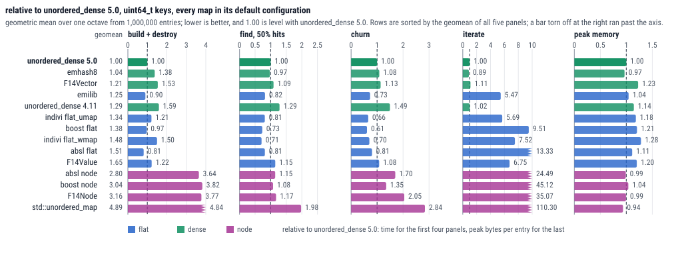
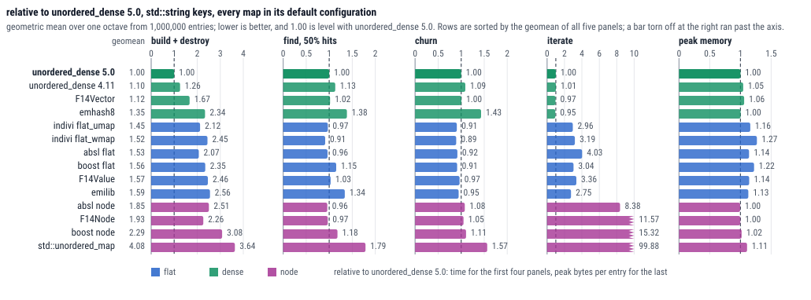
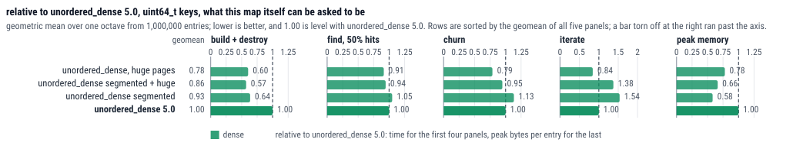
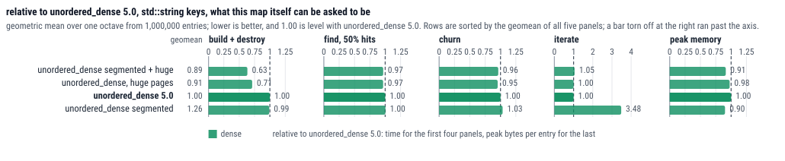

# Benchmarks

[README](../README.md) · [Usage](usage.md) · [Design](design.md) · **Benchmarks** · [Real world usage](users.md)

The long version of the two graphs in the [README](../README.md#benchmarks): what each panel
measures, what the graphs say, what `ankerl::unordered_dense`'s two opt-in shapes do to the same
numbers, and how it was all taken. Obviously I wrote both the map and the benchmark, so the bias is
where you'd expect it. Everything is relative to `ankerl::unordered_dense::map`, so 1.00 is level
with it and 2.00 is twice the cost. Raw numbers are in [bench_readme.csv](bench_readme.csv).





## What each panel measures

| panel | one operation is | `map<uint64_t, size_t>` |
|---|---|---|
| build + destroy | one insert into a map that starts empty with nothing reserved, plus that entry's share of destroying the map afterwards | 23.80 ns |
| find | one lookup, half of them hitting | 29.29 ns |
| churn | one erase and one insert at a fixed table size, with a key the map does not currently hold | 84.63 ns |
| iterate | one element visited by a full pass, summing the mapped value | 0.19 ns |
| peak memory | one live entry's share of the highest resident set the process reaches while the map is built, its baseline subtracted | 48.7 bytes |

The `geomean` column is the sort key and nothing more. Every axis ends where its own bars do, except `iterate`, which stops at 10x: `std::unordered_map` needs 110x there, and an axis that fits that turns every other bar into a sliver. The bars that run past it are drawn torn off, with the real number next to them.

## Iteration is what the dense layout buys, integer find is what it costs

**Iteration is what the dense layout buys.** One pass costs 0.19 ns per element with `uint64_t` keys. The elements sit in a `std::vector` and the pass never looks at the index at all. The flat maps need 5.5x to 13x of that because they walk metadata and skip empty slots, and `std::unordered_map` needs 110x because it chases a pointer per element. If you iterate often, no other panel here will matter as much.

**With string keys it builds and destroys 2.1x to 2.6x faster than any flat map.** 93 ns per entry, against 192 ns for `absl::flat_hash_map` and 237 ns for `emilib`. Part of that is the hash: with `uint64_t` keys, where the hash is nearly free, `absl::flat_hash_map` is at 0.81 and `emilib` at 0.90, so the index is not what makes the string case fast.

**The rest of it is the teardown, which is why that panel includes it.** Freeing a million `std::string` buffers costs this map 14 ns per entry and every flat map 64 to 68 ns. The strings are the same strings; what differs is the order they are released in. A dense map keeps its elements in insertion order, so the frees walk the heap the way it was filled, while a flat map holds them in hash order and frees them in a sequence unrelated to how they were allocated. For the node maps the teardown is not a detail at all: it is 58% to 62% of the whole lifetime with `uint64_t` keys, where for this map it is 6%. A panel that stopped at the last insert would report `absl node` at 1.46 rather than 3.64, and hide the difference entirely.

**Integer find and churn are where it loses.** Against `boost::unordered_flat_map` a `uint64_t` lookup is 0.73 and a churn pair is 0.61. `indivi::flat_umap` churns at 0.66, `indivi::flat_wmap` finds at 0.71, and `absl::flat_hash_map` is the mildest of them at 0.81 on both. That is the design and not a bug. An erase has to find the element and then re-find the slot of the element that gets swapped into the hole, and a lookup pays one indirection that a flat map does not have. With `std::string` keys the same two numbers against boost are 1.15 and 0.91, so the hash pays most of it back.

**Peak memory is measured as resident pages, and that is not the same as bytes asked for.** Every flat map here holds 1.04x to 1.28x per `uint64_t` entry, and the node maps 0.94x to 1.04x. The flat maps are not asking for more -- counted in bytes requested, `absl::flat_hash_map` is at 0.96 where resident pages put it at 1.11. The difference is what a doubling array leaves behind: each superseded block is freed but stays resident in glibc's arena, and the next one is twice its size, so it cannot be reused. A map that allocates a million uniform nodes leaves nothing behind, and its two numbers agree to 1%.

Which number you want depends on the allocator. The ~30% is glibc's retention policy rather than a property of the map, and another allocator will not reproduce it; the bytes-requested figure is in [bench_readme.csv](bench_readme.csv) under `memory` if that is the question you have.

**5.0.0 builds and destroys `uint64_t` 1.6x faster than 4.11.0.** 4.11.0 is on the charts above, in the middle of the field rather than beside 5.0.0, which is the honest place for it. It is the robin hood index that 5.0.0 replaced: it builds and destroys at 1.59, finds at 1.29, churns at 1.49 and holds 1.14x the peak memory. Unfortunately the same comparison with `std::string` keys is only 1.26, 1.13 and 1.09, and part of even that is not the index at all: 5.0.0 also mixes the string hash in independent 16 byte blocks instead of chaining them, which took one hash of these keys from 2.52 ns to 2.00 ns under clang.

## Huge pages and segmented values move more than the choice of library

The same run and the same reference, for the shapes this one map can be asked to take: segmented values, huge pages, or both.





[Huge pages](usage.md#huge-pages) take a `uint64_t` build and destroy to 0.60 and a churn to 0.79, for a one word change of the type. That 1.66x is larger than the biggest single-panel gain any other library here offers, which is boost's 1.64x on integer churn. [`segmented_map`](usage.md#segmented_map-and-segmented_set) builds at 0.64 because it never reallocates and moves the values, and it holds the lowest peak memory of any map in this run, 28.4 bytes per entry against 48.7 -- it is the map that leaves nothing superseded behind at all. It pays 1.54 on iteration for the extra indirection, and 3.48 with string keys. Both are opt-in, neither is the default.

## How the numbers were taken, and what they do not say

The charts cover 1 million to 2 million entries, which is past every cache level on this machine, and smaller tables sort the maps differently. Also `iterate` counts a full pass over every element, which plenty of programs never do. Treat anything under roughly 5% as a tie.

The first panel times construction, the inserts and the destructor. The inserts on their own are in the CSV under `build`, and the difference between the two columns is what the teardown costs.

One binary per map, because a binary with a dozen maps in it has a code layout that moves more than the differences being drawn. 5 table sizes spanning exactly one doubling, geometric mean over them: a load factor runs a sawtooth between doublings and two maps do not double at the same size, so a ratio at a single size compares two arbitrary points of two different cycles. For a pair from different families I measured that at up to 26%. 10 million operations per timed cell, and 3 rounds over the whole set of maps, median, each round preceded by an untimed warmup of that cell.

Peak memory is the process's own high-water mark: `VmHWM` is reset through `/proc/self/clear_refs` before the fill and read after it, with the resident set beforehand subtracted so that the key pools and the binary are not charged. Each fill runs in a forked child, because glibc does not hand a grown arena back and a second fill in the same process would reuse resident pages and read far too low.

The same run also counts bytes requested, by interposing `malloc`, `calloc`, `realloc`, `free`, `mmap` and `munmap` and charging each block `malloc_usable_size` plus glibc's chunk header. Those numbers are in the CSV under `memory`. The binary that counts is not the binary that times: interposing `malloc` costs a map that allocates per element a few percent and a dense map nothing, which is a bias that would land on one family only.

The benchmarks behind the design notes ask a different question and hand every map the same hash, so that only the index differs. Here the hash is part of what a caller gets, so it stays in.

Ryzen 9 7950X, Fedora 44, clang 22.1.8, `-O3`, transparent huge pages on `madvise`, the measured process pinned to one core. Boost 1.90, Abseil LTS 20250814, folly `65749da`, emhash and emilib `20a28e8`, indivi `27ff2ce`.

```sh
scripts/ab/bench_readme.sh            # 1h40m, writes doc/bench_readme.csv and the four SVGs
scripts/ab/bench_readme.sh -w memory  # re-take a single panel
```
