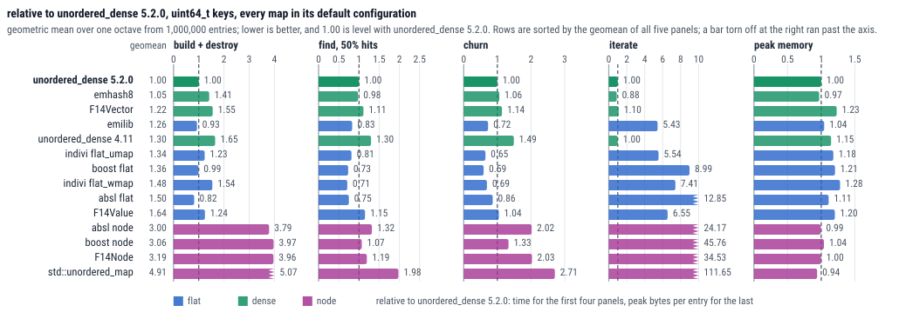
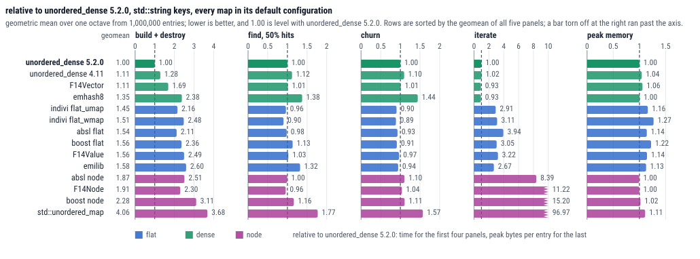
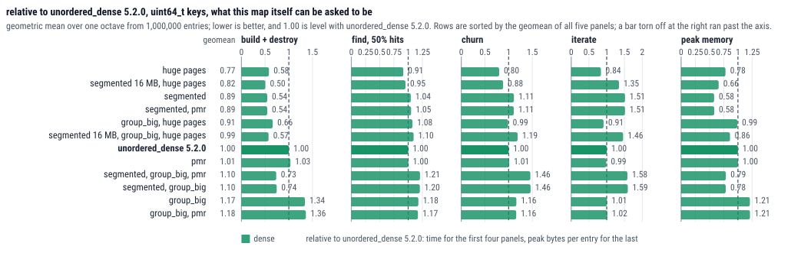
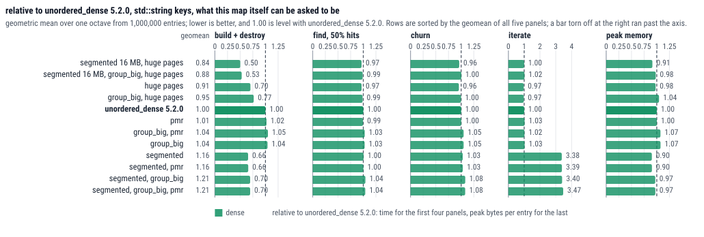

# Benchmarks

[README](../README.md) · [Usage](usage.md) · [Design](design.md) · **Benchmarks** · [Real world usage](users.md)

The long version of the graphs in the [README](../README.md#benchmarks), plus every configuration `ankerl::unordered_dense` itself can be put in. Obviously I wrote both the map and the benchmark, so the bias is where you'd expect it. Every `unordered_dense` row is the latest release, 5.2.0, and everything is relative to its `ankerl::unordered_dense::map`: 1.00 is level with it, 2.00 is twice the cost. Raw numbers are in [bench_readme.csv](bench_readme.csv).





| panel | one operation is | `map<uint64_t, size_t>` |
|---|---|---|
| build + destroy | one insert into an empty map, nothing reserved, plus its share of destroying the map | 23.2 ns |
| find | one lookup, half of them hitting | 29.7 ns |
| churn | one erase plus one insert of a key not in the map, at a fixed size | 88.3 ns |
| iterate | one element of a full pass, summing the mapped value | 0.20 ns |
| peak memory | one entry's share of the highest resident set while building, baseline subtracted | 48.6 bytes |

The `geomean` column is only the sort key. `iterate` is capped at 10x, because `std::unordered_map` needs 112x there and would squash every other bar. Bars that run past the axis are drawn torn off, with the real number next to them.

## Iteration is what the dense layout buys, integer find and churn are what it costs

**Iteration:** 0.20 ns per element with `uint64_t` keys. The elements sit in a `std::vector`, and a pass never looks at the index. The flat maps need 5.4x to 13x of that because they walk their metadata and skip empty slots, and `std::unordered_map` needs 112x because it follows a pointer per element.

**Building with string keys:** 2.1x to 2.6x faster than every flat map here, 93 ns per entry against 196 for `absl::flat_hash_map` and 241 for `emilib`. Most of that is the teardown: freeing a million `std::string` buffers costs `unordered_dense` 15 ns per entry and every flat map 64 to 71 ns. Same strings, different order. A dense map frees them in insertion order, the way the heap was filled, a flat map in hash order. With `uint64_t` keys there is nothing to free per element, and `absl::flat_hash_map` builds at 0.82. For the boost, absl and F14 node maps the teardown is 56% to 61% of the lifetime, so a panel without the destructor would show `absl node` at 1.59 instead of 3.79. Inserts alone are in the CSV under `build`.

**Integer find and churn:** against `boost::unordered_flat_map`, a `uint64_t` lookup is 0.73 and a churn pair 0.59. `indivi::flat_umap` churns at 0.65, `indivi::flat_wmap` finds at 0.71, `absl::flat_hash_map` reads 0.75 and 0.86. That is the design. A lookup pays one more dependent load than a flat map, and an erase has to find the element and then re-find the slot of the one that gets moved into its hole. With `std::string` keys the hash pays most of it back: 1.13 and 0.91 against boost.

**Peak memory:** resident pages, which is not the same as bytes requested. The flat maps hold 1.04x to 1.28x per `uint64_t` entry, the node maps 0.94x to 1.04x. Counted as bytes requested, `absl::flat_hash_map` is at 0.96 where resident pages put it at 1.11. The difference is what a doubling array leaves behind: the old block is freed but stays resident in glibc's arena, and the next one is twice as big, so it can't reuse it. That is glibc's policy and not a property of any map; bytes requested are in the CSV under `memory`.

**Against 4.11.0**, the robin hood index that 5.0.0 replaced: `uint64_t` build + destroy 1.65x faster, find 1.30x, churn 1.49x, and 1.15x the peak memory. With `std::string` keys it is only 1.28, 1.12 and 1.10.

## Every configuration of `unordered_dense`, and which ones are worth it

The same run, for the options `unordered_dense` has ([#349](https://github.com/martinus/unordered_dense/issues/349)): values in a `std::vector` or [`segmented_map`](usage.md#segmented_map-and-segmented_set), the index as `bucket_type::group` or `group_big`, and the allocator as `std::allocator`, `pmr::` on the default resource, or [huge pages](usage.md#huge-pages). That is 12 combinations. `pmr` and huge pages both go in the allocator slot, so they don't combine. The huge page segmented rows use 16 MB segments as [usage.md recommends](usage.md#sizing-a-segment-for-a-huge-page), all other segmented rows the 4096 byte default.





Ratios to `map`, `uint64_t` / `std::string` keys:

| configuration | build + destroy | find | churn | iterate | peak memory |
|---|---|---|---|---|---|
| `pmr::map` | 1.03 / 1.02 | 1.00 / 0.99 | 1.01 / 1.00 | 0.99 / 1.03 | 1.00 / 1.00 |
| `group_big` | 1.34 / 1.04 | 1.18 / 1.03 | 1.16 / 1.05 | 1.01 / 1.03 | 1.21 / 1.07 |
| `segmented_map` | 0.54 / 0.66 | 1.04 / 1.00 | 1.11 / 1.03 | 1.51 / 3.38 | **0.58** / **0.90** |
| `segmented_map`, `group_big` | 0.74 / 0.70 | 1.20 / 1.04 | 1.46 / 1.08 | 1.59 / 3.40 | 0.78 / 0.97 |
| `huge_page::map` | 0.58 / 0.70 | **0.91** / 0.97 | **0.80** / 0.96 | **0.84** / 0.97 | 0.78 / 0.98 |
| `huge_page::segmented_map`, 16 MB | **0.50** / **0.50** | 0.95 / 0.97 | 0.88 / 0.96 | 1.35 / 1.00 | 0.66 / 0.91 |
| `huge_page::segmented_map`, 16 MB, `group_big` | 0.57 / 0.53 | 1.10 / 0.99 | 1.19 / 1.00 | 1.46 / 1.02 | 0.86 / 0.98 |

`pmr` on the default resource costs nothing measurable. Every cell is within 3.5% of `map`, and with `group_big` or `segmented_map` it is within 2.1% of the same configuration without `pmr`, so those rows are only in the charts. A dense map allocates a few large blocks, so a virtual call per allocation does not show up.

`group_big` is for more than 2^32 elements, below that it is pure cost. Its group block is 152 bytes instead of 88, so the index is 1.7x the size and misses the cache more often. With string keys the hash dominates and the cost shrinks to 3% to 7%.

`segmented_map` never reallocates: growing adds a segment instead of copying everything into a block twice the size, and no superseded block stays behind. With `uint64_t` keys that makes it build 1.9x faster, and 28.2 bytes per entry is the lowest peak memory of any map in this run. The extra indirection costs 4% on find, 11% on churn and 51% on iteration. Unfortunately iterating with `std::string` keys is 3.38x, and with 16 MB segments on huge pages it is 1.00. That changes both the segment size and the page, so it does not say which of the two it is; [#350](https://github.com/martinus/unordered_dense/issues/350) is about finding out. Combined with `group_big`, the combination the issue asked about, both costs add up for integer keys: 1.20 on find and 1.46 on churn.

Huge pages are the largest gain on this page: 1.7x on the integer build and 1.25x on churn, for a one word change of the type. As far as I can say the lower peak memory comes from the allocator giving superseded blocks back to the kernel with `munmap`, where glibc keeps them resident. With 16 MB segments it builds fastest of everything here, 0.50 for both key types.

So:

- `map` if you don't know. Without huge pages, no configuration beats it on find, churn or iteration by more than 2%.
- `huge_page::map` for tables of more than a few MB, if the allocator in the type is fine. It is at or below `map` on every panel here. At 50000 entries no block reaches 2 MB and it does nothing.
- `segmented_map` if references must stay valid while inserting, or peak memory matters most, and iteration does not.
- `group_big` only for more than 2^32 elements.
- `pmr::` whenever you need it.

## A loop that divides and stores can run 5x slower, whatever map is in it

On a Ryzen 9 7950X (Zen 4, the only CPU I measured it on), three things together stop a lookup loop from overlapping its cache misses, and none of them is the map:

- a loop variable the compiler keeps on the stack, stored and reloaded every iteration (e.g. the state of the random generator that picks the next key),
- a 64 bit division on the way from that variable to the next key (`r() % n`),
- a store into the element just found, whose address depends on a cache miss (`++m[key]`).

Two plain arrays of 16M entries, no map anywhere, cycles per iteration, [scripts/ab/spill_trap.cpp](../scripts/ab/spill_trap.cpp):

| | clang 22 | gcc 16 |
|---|---|---|
| none of the three | 54 | 62 |
| any one or two of them | 66 to 88 | 63 to 88 |
| all three | **442** | **439** |
| all three, but the store goes to a fixed address | 75 | 80 |

The reload waits for the store's address, which is as long as the cache miss behind it, and the division puts that wait on the way to the next iteration's misses. Remove any one of the three and it is gone. A map only decides how many registers its inlined insert takes from the caller, and so whether the caller's variables spill. Since [#310](https://github.com/martinus/unordered_dense/issues/310), on `main` and not in 5.2.0, everything an insert does after missing the home group is a call, to keep the caller's registers free. No map can promise that the caller's loop doesn't spill, though. If a lookup loop is much slower than its cache misses explain, look at the loop first: a key computed without a division, or a loop body small enough to keep its variables in registers, makes it go away.

## How the numbers were taken, and what they don't say

- One binary per map: a binary with a dozen maps has a code layout that moves more than the differences drawn here.
- 5 table sizes spanning one doubling from 1 million entries, geometric mean. Load factor is a sawtooth between doublings, and two maps don't double at the same size, so a ratio at one size compares two random points of two cycles. For maps of different families I measured that at up to 26%.
- 10 million operations per cell, each after one untimed warmup, 3 rounds over all maps, median.
- `find` is **throughput, not latency**: each key comes from an rng, so several lookups are in flight. In a dependent chain at a million entries `unordered_dense` takes 17.0 ns against 12.0, and `boost::unordered_flat_map` 22.4 against 7.4 ([scripts/ab/latency.cpp](../scripts/ab/latency.cpp)). The ranking is different there.
- 1 to 2 million entries spans the last level cache, it does not sit past it: 64 MB of L3 in two 32 MB slices, the process pinned to one core, and a million `map<uint64_t, size_t>` entries are 26 MB. Smaller tables sort the maps differently again.
- Peak memory is `VmHWM`, reset through `/proc/self/clear_refs` before the fill, in a forked child per fill, with the resident set beforehand subtracted. Bytes requested come from a separate binary that interposes `malloc`, `calloc`, `realloc`, `free`, `aligned_alloc`, `posix_memalign`, `mmap` and `munmap`, because interposing `malloc` slows down node maps and not dense ones.
- Every map uses its own default hash, because that's what you get when you type the name. The [design notes](../notes/index-design.md) give every map the same hash, to compare only the indexes.
- `iterate` is a full pass over every element, which lots of programs never do. Treat anything under about 5% as a tie.

Ryzen 9 7950X, Fedora 44, clang 22.1.8, `-O3`, transparent huge pages on `madvise`, measured process pinned to one core, run on 1st October 2026. Boost 1.90, Abseil LTS 20250814, folly `65749da`, emhash and emilib `20a28e8`, indivi `27ff2ce`.

```sh
AB_CORE=2 AB_BUILD=/some/dir scripts/ab/bench_readme.sh -u v5.2.0   # 2h45m, writes doc/bench_readme.csv and the four SVGs
scripts/ab/bench_readme.sh -u v5.2.0 -w memory                      # re-take a single panel
```
