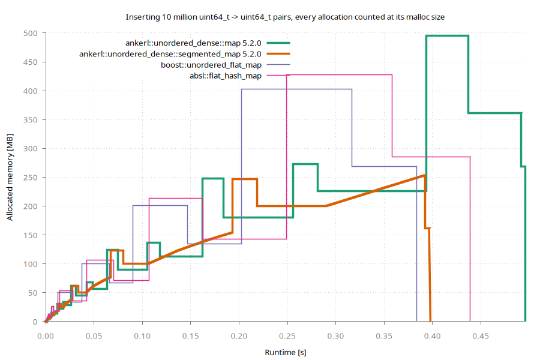

# Usage

[README](../README.md) · **Usage** · [Design](design.md) · [Benchmarks](benchmarks.md) · [Real world usage](users.md)

Almost everything `std::unordered_map` and `std::unordered_set` have is here, and works the same
way. This page is about the rest: the hash, the API a vector of values makes possible, and the
shapes `ankerl::unordered_dense::map` and `set` can be asked to take. The index itself is in
[Design](design.md).

- [Modules](#modules)
- [Hash](#hash)
  - [Simple Hash](#simple-hash)
  - [High Quality Hash](#high-quality-hash)
  - [Specialize `ankerl::unordered_dense::hash`](#specialize-ankerlunordered_densehash)
  - [Heterogeneous Overloads using `is_transparent`](#heterogeneous-overloads-using-is_transparent)
  - [Automatic Fallback to `std::hash`](#automatic-fallback-to-stdhash)
  - [Hash the Whole Memory](#hash-the-whole-memory)
  - [Marking a Hash Avalanching From Outside](#marking-a-hash-avalanching-from-outside)
  - [Requiring an Avalanching Hash](#requiring-an-avalanching-hash)
- [Container API](#container-api)
  - [`auto replace_key(iterator it, K&& new_key) -> std::pair<iterator, bool>`](#auto-replace_keyiterator-it-k-new_key---stdpairiterator-bool)
  - [`auto extract() && -> value_container_type`](#auto-extract---value_container_type)
  - [`extract()` Single Elements](#extract-single-elements)
  - [`[[nodiscard]] auto values() const noexcept -> value_container_type const&`](#nodiscard-auto-values-const-noexcept---value_container_type-const)
  - [`[[nodiscard]] auto index_bytes() const noexcept -> std::size_t`](#nodiscard-auto-index_bytes-const-noexcept---stdsize_t)
  - [`auto replace(value_container_type&& container)`](#auto-replacevalue_container_type-container)
  - [`auto hash_for(K const& key) const -> precomputed_hash`](#auto-hash_fork-const-key-const---precomputed_hash)
  - [`auto visit(FwdIt first, FwdIt last, F f) -> size_t`](#auto-visitfwdit-first-fwdit-last-f-f---size_t)
  - [`void merge(map& source)`](#void-mergemap-source)
- [Loading a map from its values and its index](#loading-a-map-from-its-values-and-its-index)
  - [What the check covers and what only `verify()` covers](#what-the-check-covers-and-what-only-verify-covers)
  - [What is portable](#what-is-portable)
  - [A custom index container](#a-custom-index-container)
- [Taking the duplicates out of a vector](#taking-the-duplicates-out-of-a-vector)
- [`std::erase_if`, and the version macros](#stderase_if-and-the-version-macros)
- [Custom Container Types](#custom-container-types)
- [`segmented_map` and `segmented_set`](#segmented_map-and-segmented_set)
- [Custom Bucket Types](#custom-bucket-types)
  - [`ankerl::unordered_dense::bucket_type::group`](#ankerlunordered_densebucket_typegroup)
  - [`ankerl::unordered_dense::bucket_type::group_big`](#ankerlunordered_densebucket_typegroup_big)
- [Disabling the Vector Probe](#disabling-the-vector-probe)
- [LLDB Data Formatters](#lldb-data-formatters)
- [Huge Pages](#huge-pages)
  - [Sizing a segment for a huge page](#sizing-a-segment-for-a-huge-page)

## Modules

`ankerl::unordered_dense` supports c++20 modules. Simply compile `src/ankerl.unordered_dense.cpp` and use the resulting module, e.g. like so:

```sh
clang++ -std=c++20 -I include --precompile -x c++-module src/ankerl.unordered_dense.cpp
clang++ -std=c++20 -c ankerl.unordered_dense.pcm
```

To use the module, e.g. in `module_test.cpp`, use 

```cpp
import ankerl.unordered_dense;
```

and compile with e.g.

```sh
clang++ -std=c++20 -fprebuilt-module-path=. ankerl.unordered_dense.o module_test.cpp -o main
```

A simple demo script can be found in `test/modules`.

The module compares fingerprints without SSE2, see [Disabling the Vector Probe](#disabling-the-vector-probe). If you
wrap the header in a module of your own and build it with gcc, you need to do the same.

## Hash

`ankerl::unordered_dense::hash` is a fast and high quality hash, descended from [wyhash](https://github.com/wangyi-fudan/wyhash) and rewritten for latency, so it does not produce wyhash's values. The `ankerl::unordered_dense` map/set differentiates between high quality hashes (good [avalanching effect](https://en.wikipedia.org/wiki/Avalanche_effect)) and low quality hashes. High quality hashes contain a special marker:

```cpp
using is_avalanching = void;
```

This is the case for the specializations `bool`, `char`, `signed char`, `unsigned char`, `char8_t`, `char16_t`, `char32_t`, `wchar_t`, `short`, `unsigned short`, `int`, `unsigned int`, `long`, `long long`, `unsigned long`, `unsigned long long`, `T*`, `std::unique_ptr<T>`, `std::shared_ptr<T>`, `enum`, `std::basic_string<C>`, and `std::basic_string_view<C>`.

Hashes that do not contain this marker are assumed to be of low quality and receive an additional mixing step inside the map/set implementation. The marker can also be spelled `using is_avalanching = std::true_type;`, and given for a hash you cannot edit -- see [Marking a Hash Avalanching From Outside](#marking-a-hash-avalanching-from-outside).

### Simple Hash

Consider a simple custom key type:

```cpp
struct id {
    uint64_t value{};

    auto operator==(id const& other) const -> bool {
        return value == other.value;
    }
};
```

The simplest implementation of a hash is this:

```cpp
struct custom_hash_simple {
    auto operator()(id const& x) const noexcept -> uint64_t {
        return x.value;
    }
};
```
This can be used, e.g. with 

```cpp
auto ids = ankerl::unordered_dense::set<id, custom_hash_simple>();
```

Since `custom_hash_simple` doesn't have a `using is_avalanching = void;` marker, it is considered to be of low quality and additional mixing of `x.value` is automatically provided inside the set.

### High Quality Hash

Back to the `id` example, we can easily implement a higher quality hash:

```cpp
struct custom_hash_avalanching {
    using is_avalanching = void;

    auto operator()(id const& x) const noexcept -> uint64_t {
        return ankerl::unordered_dense::detail::hash_int(x.value);
    }
};
```

We know `hash_int` is of high quality, so we can add `using is_avalanching = void;` which makes the map/set directly use the returned value.

### Specialize `ankerl::unordered_dense::hash`

Instead of creating a new class you can also specialize `ankerl::unordered_dense::hash`:

```cpp
template <>
struct ankerl::unordered_dense::hash<id> {
    using is_avalanching = void;

    [[nodiscard]] auto operator()(id const& x) const noexcept -> uint64_t {
        return detail::hash_int(x.value);
    }
};
```

### Heterogeneous Overloads using `is_transparent`

This map/set supports heterogeneous overloads as described in [P2363 Extending associative containers with the remaining heterogeneous overloads](https://www.open-std.org/jtc1/sc22/wg21/docs/papers/2022/p2363r3.html) which is [targeted for C++26](https://wg21.link/p2077r2). This has overloads for `find`, `count`, `contains`, `equal_range` (see [P0919R3](https://www.open-std.org/jtc1/sc22/wg21/docs/papers/2018/p0919r3.html)), `erase` (see [P2077R2](https://www.open-std.org/jtc1/sc22/wg21/docs/papers/2020/p2077r2.html)), and  `try_emplace`, `insert_or_assign`, `operator[]`, `at`, and `insert` & `emplace` for sets (see [P2363R3](https://www.open-std.org/jtc1/sc22/wg21/docs/papers/2022/p2363r3.html)).

For heterogeneous overloads to take effect, both `hasher` and `key_equal` need to have the attribute `is_transparent` set.

Here is an example implementation that's usable with any string type that is convertible to `std::string_view` (e.g. `char const*` and `std::string`):

```cpp
struct string_hash {
    using is_transparent = void; // enable heterogeneous overloads
    using is_avalanching = void; // mark class as high quality avalanching hash

    [[nodiscard]] auto operator()(std::string_view str) const noexcept -> uint64_t {
        return ankerl::unordered_dense::hash<std::string_view>{}(str);
    }
};
```

To make use of this hash you'll need to specify it as a type, and also a `key_equal` with `is_transparent` like [std::equal_to<>](https://en.cppreference.com/w/cpp/utility/functional/equal_to_void):

```cpp
auto map = ankerl::unordered_dense::map<std::string, size_t, string_hash, std::equal_to<>>();
```

For more information see the examples in `test/unit/transparent.cpp`.

### Automatic Fallback to `std::hash`

When an implementation for `std::hash` of a custom type is available, it is automatically used and assumed to be of low quality (thus `std::hash` is used, but an additional mixing step is performed).

If your `std::hash` specialization is a high quality one, say so there and it is taken at its word -- the extra mixing is then skipped, exactly as for a hash written in `ankerl::unordered_dense`. The fallback asks `hash_is_avalanching` like everything else, so either spelling of the marker works, and a `std::hash` you cannot edit can be named from outside ([Marking a Hash Avalanching From Outside](#marking-a-hash-avalanching-from-outside)):

```cpp
template <>
struct std::hash<id> {
    using is_avalanching = void;

    auto operator()(id const& x) const noexcept -> size_t {
        return ankerl::unordered_dense::detail::hash_int(x.value);
    }
};
```

### Hash the Whole Memory

When the type [has a unique object representation](https://en.cppreference.com/w/cpp/types/has_unique_object_representations) (no padding, trivially copyable), one can just hash the object's memory. Consider a simple class

```cpp
struct point {
    int x{};
    int y{};

    auto operator==(point const& other) const -> bool {
        return x == other.x && y == other.y;
    }
};
```

A fast and high quality hash can be easily provided like so:

```cpp
struct custom_hash_unique_object_representation {
    using is_avalanching = void;

    [[nodiscard]] auto operator()(point const& f) const noexcept -> uint64_t {
        static_assert(std::has_unique_object_representations_v<point>);
        return ankerl::unordered_dense::detail::hash_bytes(&f, sizeof(f));
    }
};
```

If the key is computed field by field right before the lookup, which is common for coordinates, how the bytes are read matters more than the hash itself. A read that spans two of the stores that just wrote the key has to wait until both are written to the cache, and that holds up the lookup's cache misses. Since #311, `hash_bytes` reads a key whose size is a compile-time multiple of 4 between 8 and 16 bytes as 4-byte words under gcc and clang, which avoids that; the value is the same as before. Measured with a 12-byte key of three `int32_t`, written field by field and then looked up, cycles per lookup on a Ryzen 9 7950X:

| | clang 22 | gcc 16 |
|---|---|---|
| before, two 8-byte reads | 146 | 146 |
| since #311 | 39 | 40 |
| hashing the fields as values instead | 36 | 36 |

The word reads cost about 1.4 cycles more per hash for a key that was already in memory. Other compilers, other sizes, and keys with fields narrower than 4 bytes still take the 8-byte reads. For those, hashing the fields as values avoids the problem entirely, e.g.:

```cpp
[[nodiscard]] auto operator()(coord const& c) const noexcept -> uint64_t {
    auto const xy = (static_cast<uint64_t>(static_cast<uint32_t>(c.x)) << 32U) | static_cast<uint32_t>(c.y);
    return ankerl::unordered_dense::detail::hash_int(xy ^ (static_cast<uint32_t>(c.z) * UINT64_C(0x9E3779B97F4A7C15)));
}
```

### Marking a Hash Avalanching From Outside

`using is_avalanching = void;` is a member of the hash, which is no help when the hash comes from a library you cannot edit. `hash_is_avalanching` is what the map and set actually ask, and it can be answered from outside:

```cpp
template <>
struct ankerl::unordered_dense::hash_is_avalanching<their::good_hash> : std::true_type {};
```

The extra mixing is now skipped for `their::good_hash` everywhere, without touching it. The specialization also works the other way -- `std::false_type` makes the map mix a hash's output whatever the hash claims about itself, which is the escape hatch for one that promises more than it delivers.

This is deliberately the same name, the same two ways of answering, and the same meaning as [`boost::hash_is_avalanching`](https://www.boost.org/doc/libs/latest/libs/unordered/doc/html/unordered/reference/hash_traits.html), so a hash annotated for Boost.Unordered is read correctly here and the other way around. The member may therefore also be written as a compile time bool, which is the spelling Boost's documentation asks for:

```cpp
using is_avalanching = std::true_type;   // same as `= void`
using is_avalanching = std::false_type;  // says the opposite
```

Boost calls `= void` deprecated; here it stays the ordinary spelling, since it is what this library has always documented and what every hash in the header uses. Writing anything else there -- a stray `int`, say -- is a compile error rather than a silent yes or no.

### Requiring an Avalanching Hash

In a codebase where every hash is meant to be a high quality one, forgetting to say so is the easy mistake, and nothing complains -- the map just quietly mixes. Wrap the hash to make it a build error instead:

```cpp
template <class Key, class T>
using my_map = ankerl::unordered_dense::map<Key, T, ankerl::unordered_dense::require_avalanching<my_hash<Key>>>;
```

The requirement is written into the alias rather than next to the hash, so it is part of what `my_map` *is*, and survives `my_hash` being reimplemented without its marker -- which a `static_assert` next to the hash does not. (It does not follow a map that is given a different hash outright: `map<K, V, other_hash>` names no requirement, so there is none.) It accepts a hash marked either way, by its own member typedef or by a `hash_is_avalanching` specialization.

The hash must not be `final`, since the wrapper derives from it -- for one that is, specialize `hash_is_avalanching` instead. A stateful hash goes in either braced or by value: `require_avalanching<my_hash>{my_hash{seed}}`.

## Container API

In addition to the standard `std::unordered_map` API (see https://en.cppreference.com/w/cpp/container/unordered_map), we have additional API that is somewhat similar to the node API, but builds on the fact that the values live in a random access container:

### `auto replace_key(iterator it, K&& new_key) -> std::pair<iterator, bool>`

Updates the key of an element in-place without changing its position in the underlying container. This operation maintains iterator and reference stability - all existing iterators and references remain valid after the update.

```cpp
auto map = ankerl::unordered_dense::map<std::string, int>{{"old", 1}};
auto it = map.find("old");
auto const& [pos, replaced] = map.replace_key(it, "new");
// replaced is true, pos->first is "new", pos->second is still 1, and pos == it
```

`replaced` is `false` when the new key is already in the map, and then nothing happens. Note that this can also be used as an optimization for `unordered_dense::set` when you want to `erase` one element and then `insert` a new element, this should be quite a bit faster.

### `auto extract() && -> value_container_type`

Extracts the internally used container. `*this` is emptied.

### `extract()` Single Elements

Similar to `erase()`, there is an API call `extract()`. It behaves exactly the same as `erase`, except that the return value is the moved element that is removed from the container:

* `auto extract(const_iterator it) -> value_type`
* `auto extract(Key const& key) -> std::optional<value_type>`
* `template <class K> auto extract(K&& key) -> std::optional<value_type>`

```cpp
auto map = ankerl::unordered_dense::map<std::string, int>{{"a", 1}};
if (auto taken = map.extract("a")) {
    // taken->first is "a", taken->second is 1, and the map no longer has it
}
```

Note that the `extract(key)` API returns an `std::optional<value_type>` that is empty when the key is not found.

### `[[nodiscard]] auto values() const noexcept -> value_container_type const&`

Exposes the underlying values container.

### `[[nodiscard]] auto index_bytes() const noexcept -> std::size_t`

How many bytes the index asked the allocator for. Together with the values container, that is
everything the map allocates:

```cpp
auto total = map.index_bytes() + map.values().capacity() * sizeof(decltype(map)::value_type);
```

The index is 5.5 bytes per slot with `bucket_type::group` and 9.5 with `bucket_type::group_big`, so
a table at the maximum load factor of 0.8 spends about 6.9 bytes of index per element.

Do not compute this as `bucket_count() * sizeof(bucket_type)`. That was the index in 4.x, where
there was one bucket per slot, and it is not one here: a bucket is a group of sixteen slots,
`bucket_type` is only the 24 bytes of a group that the probe compares, and the sixteen value indices
sit in the same block without being part of the type. The product reads 24 bytes per slot for both
bucket types, and it still compiles, so nothing tells you. See
[upgrading from 4.x](upgrading-to-5.md).

### `auto replace(value_container_type&& container)`

Discards the internally held container and replaces it with the one passed. Non-unique elements are
removed, and the container will be partly reordered when non-unique elements are found.

### `auto hash_for(K const& key) const -> precomputed_hash`

Hashing a key is usually the largest part of a lookup, and looking up the same key over and over hashes it every time. `hash_for()` does it once, and `find`, `contains`, `count`, `equal_range` and `at` each take what it returns as a second argument:

```cpp
auto map = ankerl::unordered_dense::map<std::string, int>();
// ...

// hash it once, e.g. at startup
auto const status_hash = map.hash_for("status");

// as often as you like
auto it = map.find("status", status_hash);
```

The key is still needed -- a lookup that lands on a bucket still has to compare keys to know it found the right one. What is skipped is the hashing, so the longer the key the more there is to gain (clang 18, x86-64, half hits and half misses):

| key length | `find(key)` | `find(key, hash)` | |
| ---------: | ----------: | ----------------: | ---: |
| 8 bytes | 5.6 ns | 4.0 ns | 1.4x |
| 32 bytes | 7.1 ns | 4.3 ns | 1.7x |
| 200 bytes | 22.5 ns | 7.4 ns | 3.0x |

`precomputed_hash` is a distinct type rather than a plain integer, because the number a lookup wants is *not* what `hash_function()` returns -- the table finalizes that further -- and an integer parameter would happily accept the wrong one. An integer does not convert to it; the value inside stays reachable, so a hash can be stored or moved around freely.

A hash belongs to the hasher, not to the table it came from. It stays valid across insertions, erasures, `rehash()` and moves, and every table using the same hasher takes it -- so one hash can serve a map and a set together:

```cpp
auto set = ankerl::unordered_dense::set<std::string>();
auto found = set.find("status", status_hash); // the hash from the map above
```

What it does not survive is the key changing. Looking up a key with the hash of a different key does not throw or crash -- it just quietly reports the key as not present.

Heterogeneous lookup works as usual when the hash and equality are transparent, and the hash may be taken from one key type and used with another:

```cpp
auto const h = map.hash_for(std::string_view("status"));
auto it = map.find("status"s, h);
```

Only lookups take a precomputed hash, and insertion never will: a lookup given the wrong hash merely misses, while an insertion given one files the element under a probe chain it is not on, losing it for good and letting a second copy of the same key in beside it. Erase is left out for a duller reason -- it hashes the moved element as well as the key, so precomputing the key's hash would save it only half its hashing.

### `auto visit(FwdIt first, FwdIt last, F f) -> size_t`

Looks up a whole range of keys, calls `f` on each one that is there, and returns how many that was.

```cpp
auto total_of(ankerl::unordered_dense::map<std::string, std::size_t> const& map,
              std::vector<std::string> const& keys) -> std::size_t {
    auto total = std::size_t{0};
    map.visit(keys.begin(), keys.end(), [&](auto const& kv) { total += kv.second; });
    return total;
}
```

`f` receives `value_type&`, or `value_type const&` on a `const` map, so a visit can modify what it
finds. Keys that are absent are not reported; the count says how many were there.

**Why it is faster than the same loop of `find()`.** A lookup on a table past the cache is two
dependent memory accesses, the group's block and then the value the slot points at, and a loop doing
one lookup at a time can only overlap them as far as the processor's own reordering reaches past a
whole loop body. `visit` works a chunk at a time in three passes: every key's block is asked for,
then the fingerprints are matched once the blocks have arrived, then the keys are compared. Every
block in the chunk is in flight at once.

`map<uint64_t, size_t>`, `scripts/ab/bulk_visit.cpp`, clang 22 on a Ryzen 9 7950X, ns per lookup,
against the same batch looked up one key at a time:

| entries | one at a time | `visit` | | half missing | `visit` | |
| ------: | ----: | ----: | ---: | ----: | ----: | ---: |
| 1 000 | 3.95 | 4.43 | 0.89x | 8.16 | 6.83 | 1.19x |
| 10 000 | 4.44 | 4.63 | 0.96x | 8.82 | 7.16 | 1.23x |
| 100 000 | 7.13 | 6.55 | 1.09x | 11.44 | 9.40 | 1.22x |
| 1 000 000 | 18.41 | 15.35 | 1.20x | 23.03 | 20.10 | 1.15x |
| 4 000 000 | 38.10 | 25.46 | **1.50x** | 34.80 | 28.01 | 1.24x |
| 16 000 000 | 36.49 | 29.03 | 1.26x | 37.35 | 30.68 | 1.22x |

**On a table that fits in cache it only pays when the lookups miss.** With every key present it is a
small loss below ten thousand entries, since there is nothing to overlap and the extra passes are
not free. With half the keys missing it is 1.15x to 1.23x at every size measured, cache-resident
ones included, because a miss that the chunk absorbs is a branch the one-at-a-time loop mispredicts.

**And the batching itself matters more than `visit` does.** If the keys are being fetched from
somewhere in the same loop that looks them up, a random index into another array say, then the key's
own cache miss sits in front of the map's and neither overlaps with anything. Collecting the keys
first and looking them up afterwards is worth 1.30x to 1.55x past a million entries before `visit`
is involved at all:

```cpp
for (size_t i = 0; i < n; ++i) {              // 50.3 ns per lookup at 4M entries
    auto it = map.find(keys[indices[i]]);
}

std::vector<key_type> batch;                  // 38.1 ns per lookup
for (size_t i = 0; i < n; ++i) { batch.push_back(keys[indices[i]]); }
for (auto const& k : batch) { auto it = map.find(k); }
```

That is a property of loops and memory parallelism rather than of this map, and it is the larger of
the two effects. `visit` is what is left on top once the loop is already shaped that way, and the two
together take that 4 million entry lookup from 50.3 ns to 25.5, which is **1.97x**.


### `void merge(map& source)`

This is the standard container's `merge`, with the guarantees a container without nodes can give. Every element of `source` whose key is not here already moves over, and the rest stay behind. An element whose key is already here is **not** overwritten -- the value already in this map wins, as with `insert` and `try_emplace`. `source` may hash and compare differently; the keys that move are re-hashed with this map's hasher. Both an lvalue and an rvalue `source` are accepted, and an rvalue one is still only emptied of what moved.

```cpp
auto a = ankerl::unordered_dense::map<std::string, int>{{"x", 1}, {"y", 2}};
auto b = ankerl::unordered_dense::map<std::string, int>{{"y", 20}, {"z", 30}};
a.merge(b);
// a is {"x", 1}, {"y", 2}, {"z", 30}   -- "y" was already in a, so a's value stayed
// b is {"y", 20}                       -- and so did b's
```

Two things differ from `std::unordered_map::merge`, and both follow from the elements living in a vector rather than in nodes:

* **Iterators and references into either container are invalidated.** A node-based merge splices nodes, so references to the elements that move stay valid. Here an element that moves is move-constructed into the destination's vector, which may reallocate.
* **The source's order changes.** Every element taken out of the middle of it leaves a gap that the elements behind it close. `erase()` already reorders for the same reason.

`a.merge(a)` has no effect. If an operation throws -- a hash, a key comparison, or an element's move -- both containers are left valid and usable, `source` keeps everything not yet taken, and the one element that was being moved at the time may be lost.

`merge` is worth using over the loop it replaces: about **2x** when the two maps mostly do not overlap, which is what a merge is usually for.

## Loading a map from its values and its index

A map is two arrays: the values, in insertion order, and the index, plain bytes with no addresses
in them. Both can be written out and read back, and a map built from them again without hashing a
single key. A `map_view` or `set_view` reads both in place, from memory the caller owns -- a file
mapping, a shared memory segment -- and copies nothing.

```cpp
using map_t = ankerl::unordered_dense::map<std::uint64_t, std::uint64_t>;

// writing: the values your way, the index as bytes, and the id next to them
map.rehash(map.size());        // a loaded index never repairs drift; take it out first
auto values = map.values();    // std::vector<std::pair<...>>, in insertion order
auto index = map.index();      // index.data(), index.size() blocks of sizeof(map_t::index_block) bytes
write(map_t::index_format_id, values, index);

// reading: compare the id, then construct from both
if (stored_id != map_t::index_format_id) { /* rebuild by inserting */ }

// an owning map: moves the values in, copies the index, checks it with trust::checked, then works as
// any map
auto loaded = map_t(std::move(values_read), map_t::index_view(blocks_read, num_blocks),
                    ankerl::unordered_dense::trust::checked);

// a read only view over the bytes where they are; trust::checked scans the index once,
// trust::unchecked is O(1) and trusts the bytes
auto view = ankerl::unordered_dense::map_view<std::uint64_t, std::uint64_t>(
    {values_ptr, num_values}, {blocks_ptr, num_blocks}, ankerl::unordered_dense::trust::checked);
```

The members:

- `index()` is the index as it is: `size()` 0 for a table that has not allocated one,
  otherwise a pointer to `index().size()` blocks. It is invalidated by anything that rehashes, as
  `values()` is by anything that grows.
- `index_format_id` is a compile-time `std::uint64_t` naming what the index bytes mean. Write it
  next to the bytes and compare before constructing. It covers the block layout, the width of a
  value index, the byte order, and the hash as far as the header can see it: the version of this
  library's hash functions, and `Hash::format_id` where the hash declares one. This library's
  hashes for integers, enums, strings, string views, and pairs and tuples of those declare one. A
  hash built on `std::hash` does not, and nothing covers a seed or any other state of a hasher:
  `verify()` is how to check those. A changed id means rebuild; nothing converts an index.
- `map(values_container&&, index_view, trust)` and the same for `set` and the segmented versions: an
  owning table. It moves the values in and copies the index. With `trust::checked` it checks every
  slot in the same loop as the copy. That is most of what the load costs: for `map<uint64_t,
  uint64_t>` 1.9-3.0 ns per entry checked against 0.45-0.49 unchecked at 1M entries, 5.8-7.1
  against 4.1-4.3 at 16M and 64M, where building the same map by inserting costs 8-45. So
  `trust::unchecked` skips it for bytes the caller vouches for. A rejected index throws
  `std::invalid_argument` (aborts without exceptions) and leaves the values with the caller.
- `map_view<Key, T, Hash, KeyEqual, Bucket>` and `set_view<...>` over `{values pointer, count}` and
  an `index_view`, with a `trust` argument and no default: `trust::checked` reads every byte of the
  index once, which on a lazily paged mapping means paging all of it in, and `trust::unchecked`
  does not. Both reject an index of the wrong shape or alignment. A view is read only: an insert,
  an erase, `clear()`, `rehash()`, `reserve()`, `max_load_factor(float)`, `swap()` and assignment
  do not compile. It is copyable, two pointers each.
- `view()` is a `map_view` of a map's own arrays, sharing its bytes, for a map whose values are one
  array (not a segmented one). `map(map_view const&)` goes back, copying both arrays and checking
  the index whatever trust the view was built with.
- `verify(verify_level::spot)` and `verify(verify_level::full)` check the index against the hasher
  (below). Both work on views.

The caller provides: values aligned for `value_type`, the index aligned for `index_block` (4 bytes
for `bucket_type::group`, 8 for `group_big`), native byte order, the same hasher state as when the
index was written, and bytes that do not change while a view reads them. A `MAP_SHARED` file that
another process writes to, or truncates, under a view is outside that: write a new file and rename
it into place.

### What the check covers and what only `verify()` covers

The check that `trust::checked` runs reads every slot and
hashes nothing: every full slot must point at a value, and the number of full slots must equal the
number of values. The first makes every lookup memory safe. The second leaves a free slot for every
insert, which the insert's walk relies on to end. An owning table also requires that no two slots
point at one value, so that every value has exactly one slot: an erase moves the last value into
the hole and repoints the one slot it finds for it, and a second slot would be left pointing past
the end. That costs the owning constructor one bit per value while it copies. A view only reads and
does not need it. A view's check costs 0.85-0.88 ns per entry at every size from 1M to 64M;
`verify(verify_level::full)` costs 3.2 ns per entry at 1M and 17 at 64M for integer keys, 11-34 for
strings at 1M-4M, and `verify(verify_level::spot)` is 16 lookups.

Bytes that pass the check can still be wrong: a value in the wrong slot, a wrong overflow counter,
and for a view, two slots pointing at one value. Lookups then give wrong answers, but never read out
of bounds and never fail to end, because every key search is bounded by the size of the table. In
an owning table, an erase on such bytes can fail to find the slot of the value it has to move and
throws `std::logic_error`, after which the table is unusable.

`verify()` is what makes them correct, through the map's own lookup: value `i` is consistent when
`find()` of its key returns `begin() + i`. That covers the fingerprint, the probe path, every
counter on it and duplicate keys. `verify_level::full` checks every value, which also proves the
index points at each value exactly once; `verify_level::spot` checks 16 values spread over the
table, which is enough to catch a different hasher or seed, and touches 16 groups. Neither finds a
counter that is too high, which makes a miss walk further and changes no answer.

`trust::unchecked` skips the check, so bytes that fail it can make a view read out of bounds.

### What is portable

The id rejects every "no" in this table:

| | 32 and 64 bit, little endian | big and little endian |
|---|---|---|
| `bucket_type::group` index, this library's hashes | yes: the same bytes and the same id | no: value indices are native endian, and string hashes read native words |
| `bucket_type::group_big` index | no: its value index is 4 bytes on 32 bit | no |
| a hash built on `std::hash` | no: its result differs between standard libraries | no |
| the values | the caller's bytes: `std::pair<uint32_t, uint64_t>` is 12 bytes on i386 and 16 on x86-64 | the caller's bytes |

The values are never written or read by the library, `std::string` included. Write them in
whatever format the rest of the file uses, and hand the table a container of them.

### A custom index container

A table object that lives inside a blob, next to its two arrays, cannot hold plain pointers: the
blob is copied or mapped at another address. The table holds the values in its value container,
which can be your own type already (see [Custom Container Types](#custom-container-types)); give
that type a member alias template, and the table takes the index container from it as well:

```cpp
template <typename T>
class offset_values {
    // ... the value container, read only: `using is_view = void;` and the interface below
public:
    template <typename Bucket>
    using index_container = offset_index<Bucket>;
};

using blob_map = ankerl::unordered_dense::map<Key, T, Hash, KeyEqual, offset_values<std::pair<Key, T>>>;
```

The alias is looked up on the type in the allocator-or-container slot, before anything else: a
container that names one gets it, a `map_view`'s values get the index view, everything else the
library's own index. `test/unit/index_container.cpp` has a self-relative pair of containers for a
table placed in a blob, and an owning one that forwards to `std::vector`.

What the index container has to provide. Both kinds:

- `using block = ankerl::unordered_dense::detail::group_block<Bucket>;` and `data()` returning a
  pointer to `size()` blocks, aligned to `alignof(block)`. When it holds no blocks, `data()` returns
  `ankerl::unordered_dense::detail::sentinel_blocks<Bucket>()`, never null: an empty table looks up
  in it without a test. Both are `static_assert`ed.
- `size()` (in blocks, 0 or a power of two of at least 4), `empty()`, `using allocator_type`, and
  `static constexpr bool nothrow_move_assignable`.
- a constructor from the table's allocator (`explicit`, any allocator type), and one from another
  of its kind and the allocator.

Read only, when the value container has `is_view`, the table only reads through it: a default
constructor (the view constructor leaves it to that and then assigns), `assign(other)` to copy
one, `assign(block const* data, std::size_t size)` for what the view
constructor is given, and `clear()` for a table that was moved from. A write to such a table does
not compile.

Owning, everything the library's own index container has, with its meaning: `get_allocator()`,
`set_allocator(a)` (give the blocks back and take `a`), `clear()` (give the blocks back),
`resize(n)` (n value-initialized blocks, replacing what is there), `assign(other)` (a copy),
`take(other)` (other's blocks, leaving it empty), `swap(other)`, `data()` in both constness and
`clear_metadata()` (zero every block's fingerprints and counters). The constructor that loads an
index into an owning table copies it with `resize()` and checks the copy, where the library's own
container does both in one loop.

### Mapping a file: `mapped_view.h`

`include/ankerl/mapped_view.h` is a separate header (it needs `<sys/mman.h>`; on Windows it
declares nothing and sets `ANKERL_UNORDERED_DENSE_HAS_MAPPED_VIEW` to 0). It opens a file, maps
it, and owns both the mapping and a `map_view` or `set_view` over it, so that the view cannot
outlive the mapping. It does not frame the file: the caller wrote it and says where the two arrays
are.

```cpp
#include <ankerl/mapped_view.h>

namespace ud = ankerl::unordered_dense;
using view_t = ud::map_view<std::uint64_t, std::uint64_t>;

// byte offsets from the start of the file, and the counts: values, then index().size() blocks
auto layout = ud::mapped_layout{values_offset, num_values, index_offset, num_blocks};
auto table = ud::mapped_view<view_t>("table.bin", layout, ud::trust::checked);
auto it = table.view().find(key);

// or map it first, read your own header out of the bytes, then hand the mapping over
auto file = ud::mapped_file("table.bin");
auto layout2 = read_my_header(file.data(), file.size());
auto table2 = ud::mapped_view<view_t>(std::move(file), layout2, ud::trust::checked);
```

The offsets decide the alignment, since a mapping starts on a page boundary: the view constructor
rejects values not aligned for `value_type` and an index not aligned for `index_block`. A layout
that reaches past the end of the file throws `std::invalid_argument`, as a misaligned one does; a file that cannot be opened or
mapped throws `std::system_error`. Without exceptions both abort. `view()` is a reference into the
object and does not compile on a temporary. The object moves (the mapping stays where it is, so the
view stays valid) and does not copy or assign.

The last argument, `ud::mapping`, says where the bytes live:

- `mapping::file`, the default: the file itself, `PROT_READ` and `MAP_SHARED`. Nothing is copied and
  nothing read until a lookup touches it, and every process that maps the file shares one copy in
  the page cache. The pages are the page cache's: 4 KB, unless the file is on hugetlbfs, where they
  are 2 MB with nothing more to ask for. `trust::checked` reads the whole index once, which pages
  all of it in; the lazy start in the table below is `trust::unchecked`. Checked, the first 100000
  lookups at 64M entries take 73 ms with the file cached (17 unchecked) and 684 ms with it evicted
  (8601 unchecked: the check reads the index sequentially, which readahead serves in large reads).
- `mapping::file_populated`: the same, with `MAP_POPULATE`, so the whole file is read before the
  constructor returns, sequentially.
- `mapping::huge_copy`: the file read into private anonymous memory on 2 MB pages (`MAP_HUGETLB` if
  huge pages are reserved, else transparent huge pages through `MADV_HUGEPAGE`; a file under 2 MB
  gets plain pages). A copy per process.

Measured for `map<uint64_t, uint64_t>`, 1M to 64M entries, clang 22 and gcc 16 on a Ryzen 9 7950X,
`scripts/ab/mapped_view.sh`. The 2 MB row is the `huge_copy` mechanism (this machine has no reserved
huge pages, so it stands in for hugetlbfs, the same 2 MB pages):

| ns per random hit, several in flight, clang / gcc | 1M | 4M | 16M | 64M |
|---|---|---|---|---|
| owning `map`, read from the file | 12.0 / 9.5 | 33.3 / 28.8 | 38.4 / 32.8 | 39.9 / 34.2 |
| `mapping::file`, 4 KB pages | 8.2 / 8.3 | 32.6 / 28.3 | 38.4 / 32.7 | 40.0 / 34.3 |
| 2 MB pages | 6.0 / 4.9 | 30.3 / 27.5 | 34.9 / 30.3 | 35.6 / 30.9 |

| ms from the constructor call until 100000 lookups are done, clang, one run per cell | 1M | 4M | 16M | 64M |
|---|---|---|---|---|
| owning `map`, file in the page cache | 17 | 64 | 253 | 1013 |
| `mapping::file`, file in the page cache | 2 | 4 | 7 | 17 |
| `mapping::file`, file not in the page cache | 17 | 87 | 233 | **8616** |
| `mapping::file_populated`, not in the page cache | 9 | 35 | 92 | 312 |
| `mapping::huge_copy`, not in the page cache | 9 | 40 | 99 | 339 |

So: 2 MB pages make lookups 1.03-1.13x faster from 4M entries up and 1.4-2.1x at 1M (how much depends
on how the file entered the page cache: a sequential read gives TLB-friendly large folios), and a 4 KB
file mapping looks up as fast as the owning map on the default allocator from 4M up, and faster
at 1M. Two processes on
`mapping::file` each show the whole file in their RSS and half of it in their PSS, and the page
cache holds it once; on `huge_copy` each holds its own. A lazy mapping of a file that is not in the
page cache pays one random read per page it touches, which at 64M entries is 26577 major faults
for the first 100000 lookups: map a file that has just been copied in or not read for a while with
`file_populated`.

The bytes have to stay what they were. What `trust::checked` checked holds for the bytes as they
were when the view was constructed. A `mapping::file` mapping shows what another process writes
to the file afterwards, and that can make a lookup read out of bounds; truncating the file under
the mapping raises `SIGBUS` on the next lookup that touches a page past the new end. Write a new
file and `rename()` it into place: a mapping keeps the old file's bytes, and the next mapping gets
the new ones. A `huge_copy` is a copy and sees neither.

## Taking the duplicates out of a vector

A `std::vector<std::string>` with repeats in it, and you want each string once. A dense set keeps
its elements in exactly such a vector, so it can take the caller's, drop the duplicates in place,
and hand it back:

```cpp
auto unique(std::vector<std::string>&& v) -> std::vector<std::string> {
    auto set = ankerl::unordered_dense::set<std::string>();
    set.replace(std::move(v));        // the set's storage is now the caller's vector
    return std::move(set).extract();  // and the caller gets it back
}
```

No string is copied and none is allocated. The only allocation in the whole function is the index.

Building the set from the range is the other way, with a `std::make_move_iterator` pair so that the
strings move rather than being copied:

```cpp
auto unique_by_insertion(std::vector<std::string>&& v) -> std::vector<std::string> {
    auto set = ankerl::unordered_dense::set<std::string>(std::make_move_iterator(v.begin()),
                                                         std::make_move_iterator(v.end()));
    return std::move(set).extract();  // the set's own vector, handed over rather than copied
}
```

Moving is safe here because the range insert probes before it constructs anything: a key already
present is skipped with the element never touched, so only the kept ones leave `v`. It is worth 1.4x
to 1.7x for keys of 8 to 135 bytes and 1.9x to 2.4x for keys of 200 bytes and up, since below the
small string buffer a move is a copy.

Nanoseconds per element of the input, `scripts/ab/unique.cpp`, clang 22 on a Ryzen 9 7950X, keys 8
to 135 bytes skewed short, median of 31 rounds or more, every version releasing the input inside the
clock. No duplicates:

| ns per input element | 1000 | 10000 | 100000 | 1000000 |
|---|---:|---:|---:|---:|
| `replace()` + `extract()` | **4.97** | **6.48** | **8.62** | **9.73** |
| range constructor + `extract()` | 14.82 | 23.68 | 23.57 | 49.83 |
| `std::sort` + `std::unique` | 44.90 | 115.12 | 146.80 | 222.62 |

Neither of the first two copies a string. What separates them is that `replace()` is handed a vector
that is already the right size, where the range constructor doubles its own.

**Use `replace()` when most of the input survives and the vector is yours to consume**, which is
2.7x to 5.1x with no duplicates in it. Duplicates narrow that, and at a million elements they turn it
over: 9.73 / 61.57 / 43.84 ns against the range constructor's 49.83 / 54.36 / 28.60 at none, half and
nine tenths. Below a hundred thousand `replace()` is still ahead at half. Why, and the `uint64_t`
control that splits it into the dedup walk and the string destructor, is in
[notes/index-design.md](../notes/index-design.md).

Both of these need a dense set. One that is not dense cannot hand its storage over at all, since its
elements are `const`, so every unique string is copied out of it on the way back:
`boost::unordered_flat_set` filled and copied into a fresh vector costs 10x to 27x the `replace()`
version here.


## `std::erase_if`, and the version macros

`std::erase_if` is specialized for the map and the set, so the C++20 spelling for erasing by a
predicate works and erases in one pass rather than one lookup per element:

```cpp
auto erased = std::erase_if(map, [](auto const& kv) { return kv.second < 0; });
```

The header's version is three macros, which is what to test against when a feature here is newer
than the copy someone else has:

```cpp
#if ANKERL_UNORDERED_DENSE_VERSION_MAJOR >= 5
// hash_for(), visit() and merge() exist
#endif
```

They are `ANKERL_UNORDERED_DENSE_VERSION_MAJOR`, `_MINOR` and `_PATCH`, and they are also what the
inline namespace is built from, so two versions of this header in one binary do not silently share
types.

## Custom Container Types

`unordered_dense` accepts a custom allocator, but you can also specify a custom container for that template argument. That way it is possible to replace the internally used `std::vector` with e.g. `std::deque` or any other container like `boost::interprocess::vector`. This supports fancy pointers (e.g. [offset_ptr](https://www.boost.org/doc/libs/1_80_0/doc/html/interprocess/offset_ptr.html)), so the container can be used with e.g. shared memory provided by `boost::interprocess`.

## `segmented_map` and `segmented_set`

`ankerl::unordered_dense` provides a custom container implementation that has lower memory requirements than the default `std::vector`. Memory is not contiguous, but it can allocate segments without having to reallocate and move all the elements. In summary, this leads to

* Much smoother memory usage of the values, which increases continuously.
* No high peak memory usage from the values.
* Faster insertion because elements never need to be moved to newly allocated blocks
* Slightly slower indexing compared to `std::vector` because an additional indirection is needed.

Here is what each of four maps holds while 10 million `uint64_t -> uint64_t` pairs are inserted into it, with `ankerl::unordered_dense` 5.2.0:


| inserting 10M pairs | held at the end | peak while filling |
|---|---|---|
| `ankerl::unordered_dense::map` | 361 MB | 495 MB |
| `ankerl::unordered_dense::segmented_map` | **253 MB** | **253 MB** |
| `boost::unordered_flat_map` | 268 MB | 403 MB |
| `absl::flat_hash_map` | 285 MB | 428 MB |

Every flat and dense map in that chart has the same sawtooth, and for the same reason: growing means allocating the new array before releasing the old one, so the transient is what a caller has to have room for even though nothing ever reports it. `ankerl::unordered_dense::map` has the tallest one, because a dense map grows a vector of values as well as an index.

`segmented_map` is the line without a sawtooth. Its values live in fixed-size segments, so growing adds a segment instead of copying everything into a bigger block, and the memory it holds only ever goes up. The one step still visible in that line is the index doubling, which segmenting does not remove -- but it happens while the values are still small, so on this run it never rises above where the map ends up, and the peak and the steady state are the same number.

The segmenting is about the values: it is those that grow smoothly and whose references stay valid. The index is one plain contiguous array either way, and growing it still allocates the new one beside the old. Since 5.0.0 that is a change from before, when the index was segmented too.

Each line runs to the end of its own fill and then drops to zero, which is that map being destroyed -- for the dense maps in two steps, the index and then the values. So where a line falls off is how long that map took to fill: 0.38 s for boost, 0.39 s for `segmented_map`, 0.44 s for abseil and 0.49 s for `map` on this machine. Do not read that as a build benchmark, though. This chart deliberately does not raise glibc's mmap threshold the way the benchmark suite does, so every large block here is faulted in from the kernel a page at a time, and it is measuring memory rather than speed.

The chart is drawn by `scripts/ab/alloc_timeline.sh -u v5.2.0`, which counts *every* allocation the process makes by replacing global `operator new` -- an allocator handed to a container sees only what that container asks for through it -- charges each one what the allocator really gave away (`malloc_usable_size` plus glibc's chunk header, so the rounding up is counted rather than guessed at), and takes a `std::chrono::steady_clock` reading at each change. The runtimes on the x axis are from one machine and one run; the byte counts are exact.

How much the remaining index spike matters depends on the size of your value. The index is 5.5 bytes per slot, so at the moment it doubles it needs about 16.5 bytes per slot transiently, against `sizeof(value_type)` bytes per element for the values. For `map<uint64_t, uint64_t>` that spike is roughly two thirds of the value storage; for a map with a large value it is a rounding error; for a `set<uint64_t>` it is larger than the values. If you need the index to grow smoothly as well, `reserve()` up front avoids the doubling entirely, which is worth doing for a large map whatever container it uses.

The size of a segment is a template parameter, and it defaults to 4096 bytes, which is small. A map
that is going on huge pages wants it set: see [Sizing a segment for a huge page](#sizing-a-segment-for-a-huge-page).

A map whose values own heap memory wants it set too. A `segmented_map<std::string, size_t>` with
4096 byte segments iterates 3.3x slower than `map` at 4M entries, because its 2560 byte segments
are allocated between the strings' own buffers and every one of them starts the walk cold; with
256 KB segments it is 1.24x, with 16 MB 1.06x, and lookups, churn and memory do not change. For
values without heap memory the segment size makes no difference to iteration. The default stays
small because a non-empty segmented map holds at least one whole segment:

```cpp
// 256 KB segments for a map of strings
using map_t = ankerl::unordered_dense::segmented_map<std::string, std::size_t, ankerl::unordered_dense::hash<std::string>,
                                                     std::equal_to<std::string>, std::allocator<std::pair<std::string, std::size_t>>,
                                                     ankerl::unordered_dense::bucket_type::group, 256 * 1024>;
```

## Custom Bucket Types

The index is groups of sixteen slots; the bucket type chooses how wide a value index is. The
default should be good for pretty much everyone. See [the design notes](design.md) for how the index
works.

### `ankerl::unordered_dense::bucket_type::group`

* Up to 2^32 = 4.29 billion elements.
* 5.5 bytes overhead per slot: one 88 byte block per group of sixteen slots, holding the sixteen fingerprints, the group's eight overflow counters and sixteen 4 byte value indices.

### `ankerl::unordered_dense::bucket_type::group_big`

* Up to 2^63 = 9,223,372,036,854,775,808 elements.
* 9.5 bytes overhead per slot: the same block with 8 byte value indices instead of 4 byte ones, so 152 bytes per group.

## Disabling the Vector Probe

A probe compares a group's sixteen fingerprints at once: with one SSE2 instruction on x86-64, and
with NEON on AArch64. Neither needs a compiler flag, because both are part of their target's
baseline. Defining `ANKERL_UNORDERED_DENSE_HAS_SSE2` or `ANKERL_UNORDERED_DENSE_HAS_NEON` to 0
before the header is included switches to the portable fallback, which compares eight fingerprints
per machine word with ordinary arithmetic, e.g. with cmake:

```cmake
target_compile_definitions(your_target PRIVATE ANKERL_UNORDERED_DENSE_HAS_SSE2=0)
```

The module in `src/` sets both already, because the intrinsics are declared by headers included in
the global module fragment and those declarations do not reach a translation unit that imports the
module. Wrapping the header in a module of your own means doing the same.

All three compare the same sixteen bytes and differ only in how they report which lanes matched, so
translation units that disagree about these macros still agree about every byte of the index they
share. On x86-64 the word-at-a-time fallback is within a few percent of SSE2 on the benchmark's
workloads; on AArch64 it is not, which is why the NEON path exists.

## LLDB Data Formatters

The repository ships a formatter script for LLDB in [`lldb/unordered_dense.py`](../lldb/unordered_dense.py). It makes
`map`, `set`, `segmented_map`, `segmented_set` (including the `pmr::` variants) and `segmented_vector` print like
regular containers instead of raw internals, across `map`'s every flavor with one provider:

```
(lldb) frame variable word_count
(ankerl::unordered_dense::map<std::string, int> &) word_count = size=3 bucket_count=64 {
  [alpha] = (first = "alpha", second = 1)
  [beta] = (first = "beta", second = 2)
  [gamma] = (first = "gamma", second = 3)
}
```

Load it with

```
command script import /path/to/unordered_dense/lldb/unordered_dense.py
```

or put that line into `~/.lldbinit` to always have it. Elements are the densely stored values in the container's
iteration order -- insertion order until something is erased -- and children are named after their key when the key
renders as a short scalar or string (`v map[2]` works by index regardless). The script only reads memory, so it is
safe on core dumps, and `frame variable -R <var>` still shows the raw members whenever they are wanted. Naming
children by key can be turned off with

```
script unordered_dense.NAME_CHILDREN_BY_KEY = False
```

Custom value containers (see [Custom Container Types](#custom-container-types)) fall back to whatever LLDB itself can display for
them.

## Huge Pages

A lookup touches two or three random addresses -- the group's block, the value it points at, and for a string key its body -- and on 4 KB pages each of them is an address translation. A first-level data TLB holds on the order of 64-96 entries, a few hundred KB, so any table larger than that pays an L2 TLB lookup per access, and on a dependent chain that lookup is latency. Measured on this library's own scored benchmark by running the same binary with its heap on 2 MB pages: **2.6% (gcc) to 3.6% (clang) over the whole score, 5-8% on churn and on random finds at 50000 entries, and 22% of a lookup past the last-level cache**. Nothing asks for huge pages by default, and on the common Linux setting (`/sys/kernel/mm/transparent_hugepage/enabled` = `madvise`) nothing gets them without asking. There are two ways to ask.

**The environment, for the whole process.** glibc 2.35 and later can `madvise` its heap for you:

```sh
GLIBC_TUNABLES=glibc.malloc.hugetlb=1 ./your_program
```

This is what the numbers above were measured with, and it is the route that helps *small* tables too, because neighbouring blocks share a 2 MB extent on the heap. Setting the THP mode to `always` does the same for every process on the machine.

**The allocator, for one map.** `include/ankerl/huge_page_allocator.h` is a separate header (it needs `<sys/mman.h>`) with an allocator that puts every block of 2 MB and up on its own 2 MB-aligned, `MADV_HUGEPAGE`d mapping and leaves smaller ones to `std::allocator`:

```cpp
#include <ankerl/huge_page_allocator.h>

using map_t = ankerl::unordered_dense::huge_page::map<uint64_t, uint64_t>;
```

`huge_page::map`, `segmented_map`, `set` and `segmented_set` fill the allocator slot for you. This names the same type:

```cpp
using map_t = ankerl::unordered_dense::map<uint64_t, uint64_t,
                                           ankerl::unordered_dense::hash<uint64_t>,
                                           std::equal_to<uint64_t>,
                                           ankerl::unordered_dense::huge_page_allocator<std::pair<uint64_t, uint64_t>>>;
```

Both the index and the values get it, since the index rebinds the value allocator. What it is worth, ns per operation with `std::allocator` and with this one, on the scored workloads at sizes the score does not run (clang, Ryzen 9 7950X; gcc within a few percent of the same ratios):

| | 200000 | 800000 | 4000000 |
|---|---|---|---|
| build from empty, `uint64_t` | 20.4 → 13.3 (**1.53x**) | 22.1 → 12.8 (**1.73x**) | 38.4 → 24.6 (**1.56x**) |
| build from empty, `std::string` | 71.9 → 63.6 (1.13x) | 85.5 → 68.6 (1.25x) | 121.8 → 94.4 (1.29x) |
| churn at a fixed size, `uint64_t` | 12.7 → 12.3 (1.03x) | 16.1 → 12.1 (**1.33x**) | 53.7 → 49.4 (1.09x) |
| random find, 50% hits, `uint64_t` | 5.49 → 5.45 | 6.50 → 6.21 (1.05x) | 16.3 → 14.3 (1.14x) |

A build gains more than the TLB explains: a vector that doubles faults in every new block, and on 2 MB pages that is 512 times fewer faults. It is not specific to this map -- `boost::unordered_flat_map` on the same allocator gains 1.5-1.9x on integer builds and 1.62x on churning 64 byte values, where its single region holds the values inline -- so it changes nothing about which map is ahead where; the full table is in `notes/index-design.md`. Two things to know:

* **It only helps once the blocks themselves reach 2 MB**, which is the index from about 370000 entries and the values from `2 MB / sizeof(value_type)` entries. A huge page is 2 MB whole, and an allocator that owns only its own blocks has no neighbour to share one with -- that is what the environment route has and this one does not. Below that size, use the environment.
* **Every block is rounded up to 2 MB, and the rounding is resident memory**, because touching one byte of an `MADV_HUGEPAGE`d extent populates all of it. The map doubles both regions, so the loss is at most half a doubling step per region, while that region sits between doublings. The threshold is the second template parameter (`huge_page_allocator<T, 4 << 20>`), and it cannot go below 2 MB; the `huge_page::` aliases use the default, so a different threshold is the allocator written out.

### Sizing a segment for a huge page

A segmented map never reallocates its values, so a segment on a huge page has no rounding loss to amortize and no copy to pay. `segmented_map`, `segmented_set` and their `pmr::` and `huge_page::` twins take the segment size as a trailing parameter, after the bucket. It defaults to `default_segment_size_bytes`, which is 4096 -- far below the allocator's threshold, so a segmented map wants it set:

```cpp
ankerl::unordered_dense::huge_page::segmented_map<K, V, ankerl::unordered_dense::hash<K>, std::equal_to<K>,
                                                  ankerl::unordered_dense::bucket_type::group, 16 << 20>
```

A segment holds a power of two of elements, rounded *down* to fit the byte size, so a 2 MB segment is exactly one huge page for a 16 byte pair and 1.28 MB -- below the threshold, no huge page -- for a 40 byte one. 16 MB segments bound that rounding at 2 MB each for any element size, and are the setting to use unless `sizeof(value_type)` is a power of two. Measured at 800000 entries, ns per operation, `std::vector` on `std::allocator` / segmented on this allocator with 16 MB segments: build `uint64_t` 22.0 / 14.7, `std::string` 85.6 / **63.3**, 64 byte values 77.1 / **20.5**; churn `uint64_t` 16.1 / 14.5, `std::string` 101.0 / 95.6. The segmented container costs 10-20% on lookups and churn for its extra indirection, and huge pages do not take that back; on builds it is the fastest thing here, because it neither copies nor faults.

On Windows and macOS the class exists with the same interface and forwards everything to `std::allocator`; `huge_page_allocator<T>::uses_huge_pages` says which you got. `scripts/ab/huge_pages.sh` measures it across sizes and workloads, and the measurements are in `notes/index-design.md`.
