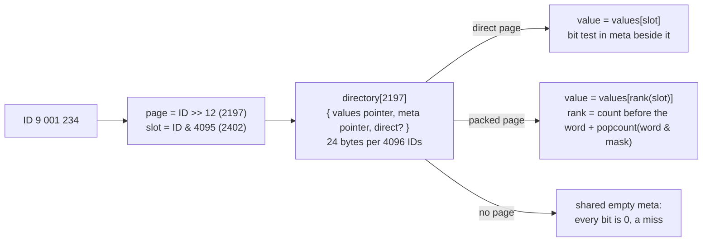
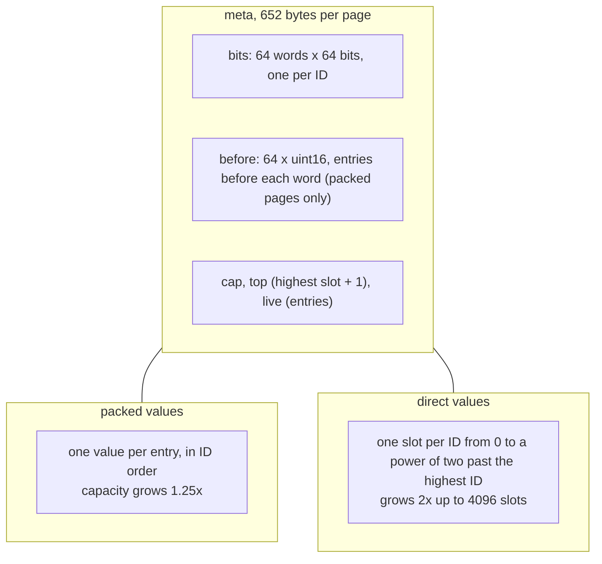
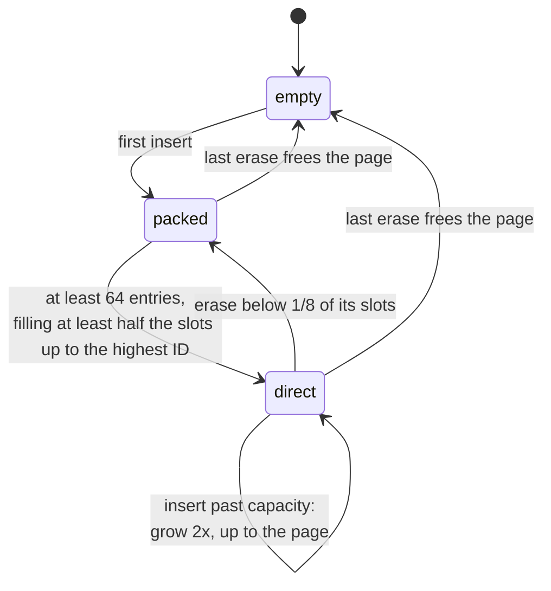
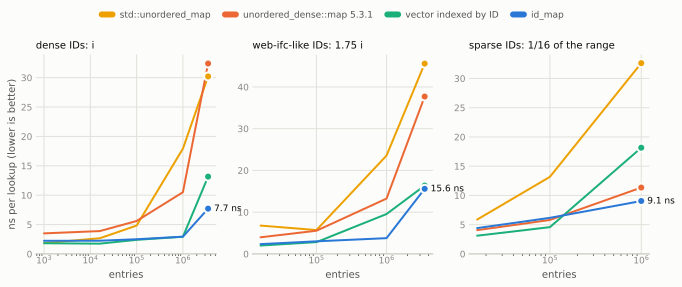
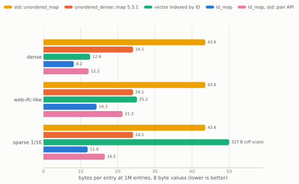
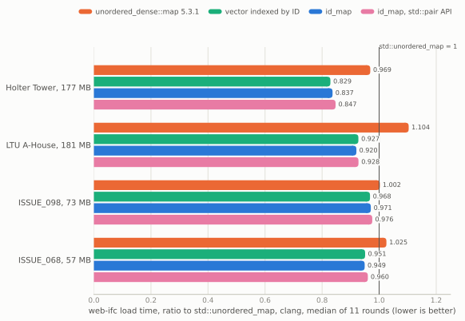
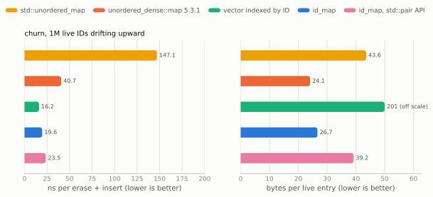

# `id_map`: a container for integer IDs that are nearly dense

`id_map<K, T>` maps integer IDs to values, for callers who know their keys are IDs: numbers handed out
mostly in order, with gaps. IFC express IDs, raft group IDs, entity IDs, row IDs and graph node IDs
are all like that. It is a prototype for issue #379 and lives in `id_map.h` next to this file. It is
not a public header.

In one sentence: a small directory of 4096-ID pages, where each page stores its values either packed
(a bitmap and a rank, small) or one slot per ID (a bitmap and a direct index, fast), chosen per page
from its own entry count.

What it buys, measured on a Ryzen 9 7950X with clang 22 and gcc 16:

- **web-ifc's IFC loader**: 3-16% less load time than with `std::unordered_map` and 3-17% less than
  with this repository's map 5.3.1 (the most on the two large models), within 1% of a plain vector
  indexed by ID, and the lowest peak memory of all of them.
- **Lookups on dense IDs**: 1.6-5.2x faster than `unordered_dense::map` from 1000 to 3.5M entries,
  close to a plain vector.
- **Memory**: 8.2 bytes per entry for 8 byte values on dense IDs (the map: 24; `std`: 44), 12 bytes
  on IDs that fill only 1/16 of their range.

And what it costs: it is not a hash map. Keys must be IDs, not arbitrary numbers, and several
workloads have a weak spot, listed under [Disadvantages](#disadvantages).

## Why a hash map is the wrong tool for IDs

A good hash spreads keys over the table on purpose, so that clustered keys do not collide. For IDs
that are already 1, 2, 3, ... this destroys the one property that makes them cheap: their order.
Issue #320 measured it in web-ifc, where the loader inserts 3.5M IDs in file order:

| 3.4M IDs inserted, then found, in order | insert | find |
|---|---|---|
| `std::unordered_map` (libstdc++ hashes a `uint32_t` to itself) | 10.6 ns | 1.2 ns |
| `unordered_dense::map` 5.3.1 | 31.7 ns | 12.0 ns |
| `std::unordered_map` given `unordered_dense`'s hash | 94.9 ns | 24.4 ns |

`std` wins because its identity hash writes buckets in key order and every access streams. Give it
a good hash and it is 3x slower than the map. A hash map cannot keep the identity: this map takes
its group from the top bits of the hash, so an order-preserving hash would have to know how many IDs
are coming. The answer is a structure indexed by the ID itself.

## Architecture

### Two levels, nothing deeper

The directory is a `std::vector` with one 24 byte entry per 4096 IDs of range: 21 KB for 3.5M IDs,
small enough to stay in the L1 or L2 cache. A lookup loads the entry, then the value. There is no tree:
Linux's `xarray` and Judy, both radix trees, need 4-6 dependent loads at this size.

### A page

A packed page stores only the entries that exist. To find entry `s`, it counts the set bits before
`s`: the `before` count of its 64-bit word plus a popcount of the word masked below `s`. A direct
page stores a slot for every ID up to its highest one, so the value's address is `values + s` and
needs nothing from the bitmap. The bit test still decides hit or miss, but it runs in parallel with
the value load.

### A page's life

The switch is decided per page from that page's own entries, never from the map as a whole. Dense
regions of the ID space become direct and sparse regions stay packed in the same map. The gap
between the two thresholds (1/2 to go direct, 1/8 to go back) keeps a page at the boundary from
converting back and forth.

## Why it is fast

Each item below was measured. The removed alternatives are in the notes entry.

1. **One dependent load after a directory that is always in cache.** A direct lookup is: read the
   directory entry (L1), read `values[slot]`. That is the same chain as a vector indexed by ID; the
   map needs its group, its fingerprint compare and then the value.
2. **No null check on a miss.** Directory entries without a page point to one shared static `meta`
   whose bits are all zero (from EnTT). A miss is the bounds check and one bit test.
3. **A branch, not a select, between direct and packed.** Written as `direct ? s : rank(s)`, the
   compiler emitted a select, which computes the rank and loads its counts on every lookup. A branch
   with `__builtin_expect` removed that: 7.2 to 6.4 ns at 3.5M dense IDs.
4. **Small dense tables become direct too.** The rule counts against the highest ID in the page, not
   against 4096, so IDs 0..999 become a direct page of 1024 slots: 1000 dense lookups went from 3.5 ns
   (packed) to 1.4 ns.
5. **Building costs little.** Values are constructed in place and never moved when the directory
   grows (EnTT, flecs); only packed pages keep their per-word counts, which took a build from 5.1 to
   3.3 ns per ID; the compiler turns the count update into SSE2 `paddw`.

<picture>
  <source media="(prefers-color-scheme: dark)" srcset="img/lookups-dark.svg">
  
</picture>

A million independent lookups of random present IDs (throughput, not latency), median of five
rounds after a warm-up, clang / gcc, ns per lookup:

| | std::unordered_map | unordered_dense::map 5.3.1 | vector indexed by ID | id_map | id_map, std::pair API |
|---|---|---|---|---|---|
| dense 1,000 | 1.70 / 1.72 | 2.89 / 3.07 | 1.29 / 1.29 | 1.69 / 1.88 | 1.68 / 2.03 |
| dense 16,000 | 2.41 / 2.30 | 3.24 / 3.38 | 1.29 / 1.31 | 1.70 / 1.88 | 1.73 / 2.06 |
| dense 100,000 | 4.44 / 4.05 | 5.11 / 4.91 | 1.69 / 1.68 | 1.98 / 2.08 | 2.24 / 2.31 |
| dense 1,000,000 | 16.45 / 15.04 | 9.53 / 9.14 | 2.10 / 2.25 | 2.44 / 2.61 | 2.54 / 2.65 |
| dense 3,500,000 | 29.66 / 27.21 | 32.18 / 32.17 | 8.65 / 8.80 | 6.15 / 12.73 | 10.70 / 13.33 |
| web-ifc-like 16,000 | 6.52 / 5.37 | 3.46 / 3.61 | 1.47 / 1.55 | 1.83 / 2.14 | 1.84 / 2.41 |
| web-ifc-like 100,000 | 5.43 / 5.16 | 5.13 / 5.26 | 2.05 / 2.15 | 2.55 / 2.66 | 2.62 / 2.86 |
| web-ifc-like 1,000,000 | 22.90 / 20.77 | 11.28 / 10.40 | 5.90 / 7.19 | 3.23 / 3.29 | 3.85 / 4.08 |
| web-ifc-like 3,500,000 | 40.32 / 36.12 | 34.86 / 33.25 | 11.75 / 12.01 | 14.11 / 13.82 | 14.74 / 15.41 |
| sparse 1/16 16,000 | 4.96 / 4.38 | 3.78 / 3.80 | 2.20 / 2.37 | 4.20 / 4.19 | 4.32 / 4.52 |
| sparse 1/16 100,000 | 11.74 / 10.49 | 5.52 / 5.56 | 3.52 / 3.60 | 5.73 / 5.93 | 6.20 / 6.45 |
| sparse 1/16 1,000,000 | 30.40 / 27.15 | 10.17 / 10.90 | 13.56 / 13.69 | 8.39 / 8.50 | 9.46 / 9.68 |

The dense 3.5M cell is the noisy one: the same `id_map` code read 5.5 to 12.7 ns across runs on
this machine, so read that row as "5.5-13 ns, against 32 for the map".

## Why it is memory efficient

- **Packed pages pay only for what exists**: 8 bytes per 8 byte value plus 0.16 bytes per ID of range
  for the bitmap and counts. A sparse region costs about what its entries cost.
- **Direct pages only exist where at least half the slots are used**, so a gap costs at most one slot
  per entry on average.
- **Nothing doubles.** A vector indexed by ID reallocates and copies itself as the largest ID grows,
  and holds old and new arrays at once. Pages are allocated one by one and the directory copies only
  24 byte entries.
- **No hash index.** The map spends 5.5 bytes per slot on its index plus the slack of its load factor.

<picture>
  <source media="(prefers-color-scheme: dark)" srcset="img/memory-dark.svg">
  
</picture>

| 1M entries, clang: build ns per ID / bytes per entry | std::unordered_map | unordered_dense::map 5.3.1 | vector indexed by ID | id_map | id_map, std::pair API |
|---|---|---|---|---|---|
| dense | 13.6 / 43.6 | 11.3 / 24.1 | 1.5 / 12.6 | 3.9 / 8.2 | 4.0 / 12.2 |
| web-ifc-like | 18.0 / 43.6 | 11.3 / 24.1 | 3.1 / 25.2 | 4.2 / 14.3 | 4.5 / 21.3 |
| sparse 1/16 | 38.8 / 43.6 | 11.0 / 24.1 | 34.9 / 327.2 | 8.6 / 11.9 | 10.0 / 16.5 |

Memory here is malloc's bytes in use after the build, divided by the entry count.

## In a real program: web-ifc

web-ifc's `IfcLoader::_lines` maps each express ID to its line. Replacing only that member, on four
of web-ifc's public test models, load time (parse and geometry) as a ratio to `std::unordered_map`,
median of eleven interleaved rounds on one pinned core:

<picture>
  <source media="(prefers-color-scheme: dark)" srcset="img/webifc-dark.svg">
  
</picture>

| ratio to std, clang / gcc | unordered_dense::map 5.3.1 | vector indexed by ID | id_map | id_map, std::pair API |
|---|---|---|---|---|
| Holter Tower, 177 MB | 0.969 / 0.975 | 0.829 / 0.849 | 0.837 / 0.854 | 0.847 / 0.866 |
| LTU A-House, 181 MB | 1.104 / 1.094 | 0.927 / 0.935 | 0.920 / 0.929 | 0.928 / 0.935 |
| ISSUE_098, 73 MB | 1.002 / 1.000 | 0.968 / 0.972 | 0.971 / 0.974 | 0.976 / 0.978 |
| ISSUE_068, 57 MB | 1.025 / 1.022 | 0.951 / 0.956 | 0.949 / 0.955 | 0.960 / 0.962 |
| peak RSS | 0.904-0.948 | 0.914-0.984 | 0.870-0.909 | 0.899-0.935 |

The meshes and vertex counts are identical for all variants.

Two more programs, with `-DWITH_ID_MAP` in their harnesses:

- **Redpanda's leader balancer** (`redpanda_lb.sh`): with 80 groups, 4.60 ms against main's map 5.04
  and 4.5.0's 4.55 (clang); with one ID per raft group (92160), 3.71 ms against 5.54 and 4.81, the
  fastest of the seven containers there, gcc alike.
- **`small_hits`' dense IDs** (#346): 0.51-0.68 of the map's time in a quiet loop and 0.62-0.87 in a
  busy one, at 1000-16000 entries.

## Where the ideas came from

Five implementations were read before writing this one.

| read | taken | left out |
|---|---|---|
| Linux `xarray` | allocate on demand; never copy when growing | the tree and its depth |
| Judy (`JudyL`) | a bitmap with values packed by rank; the layout chosen per node from its count | about 70 node types, 6 levels |
| EnTT (`sparse_set`, `storage`) | pages behind a pointer directory; one shared empty page | a packed dense array that costs 4 dependent loads and loses ID order |
| flecs | values inline in their page | a switch to a hash map when it measures low density (a guess about the caller's data) |
| LLVM (`IndexedMap`, `SparseSet`) | the key as the index | an array sized to the whole key range; an in-band null value |

## Disadvantages

**It is for IDs, not for arbitrary integers.** The directory costs 24 bytes per 4096 IDs up to the
largest ID: 25 MB for a single key near 2^32, and nothing sensible for 64-bit hashes or random keys.
A hash map is the right tool there.

**The memory lead depends on the API.** Handing out a `std::pair<K, T>&` from iterators, as standard
maps do, needs the key stored next to every value: about 50% more memory (dense 12.2 instead of 8.2
bytes per entry, web-ifc-like 21.3 instead of 14.3). With that API the lead over the map shrinks to
0.44-0.93 of its memory. The cheaper layout hands out a proxy `{key, T&}`, which is not a standard
container interface.

**Erase-heavy use costs memory.** With IDs that drift upward (erase a random live ID, insert the next
new one), `id_map` stays fast but holds more memory than the map, because packed pages keep the
capacity they once had and direct pages stay partly filled:

<picture>
  <source media="(prefers-color-scheme: dark)" srcset="img/churn-dark.svg">
  
</picture>

| churn, clang: ns per erase + insert / bytes per live entry | std::unordered_map | unordered_dense::map 5.3.1 | vector indexed by ID | id_map | id_map, std::pair API |
|---|---|---|---|---|---|
| 16,000 | 31.2 / 42.3 | 15.1 / 23.6 | 3.8 / 196.6 | 13.4 / 26.0 | 16.3 / 38.5 |
| 100,000 | 45.2 / 45.8 | 20.7 / 22.9 | 6.5 / 251.7 | 14.9 / 26.7 | 18.2 / 39.2 |
| 1,000,000 | 147.1 / 43.6 | 40.7 / 24.1 | 16.2 / 201.3 | 19.6 / 26.7 | 23.5 / 39.2 |

**Building is slower than a vector** (3.9 against 1.5 ns per dense ID, clang), because a page spends
its first 64 entries packed and then converts. On sparse IDs it builds slower than the map up to
100000 entries (8.4-9.7 against 6.6-7.2 ns per ID, both compilers) and faster at a million (8.6-9.7
against 10.8-11.0): packed pages grow by 1.25x and keep 64 counts per page current.

**Sparse lookups depend on the build flags.** The rank uses a popcount. Built for baseline x86-64,
that is a software popcount of about 14 instructions; with `-mpopcnt` (x86-64-v2 or `-march=native`)
sparse lookups take 0.72-0.76 of the time. A header cannot turn it on by itself. Dense pages never
compute a rank and do not care.

**The per-page switch decides from the data.** Each page chooses its layout from its own entry count.
It guesses nothing about IDs not yet inserted and never changes a result, but it is a decision taken
from the caller's data, and this repository has declined optimizations that infer the caller's input
(#248). Whether this one is within that rule is open.

**Not measured**: values larger than 16 bytes, MSVC, 32-bit builds, a batched or prefetching lookup
(the map's `visit` gained 1.18-1.29x past the cache that way), huge pages.

## Tried and rejected

Three changes looked promising and did not help (`idbench tune`, two passes per compiler):

- **Bitmap and slots in one allocation**: no faster; under clang 5.5 to 5.8-5.9 ns at 3.5M dense IDs.
  The gap it was meant to close was run-to-run variation.
- **Direct pages growing 4x instead of 2x**: builds 8-10% faster, in-cache lookups 6-10% slower under
  clang. Lookups matter more.
- **Back to packed at 1/4 instead of 1/8**: more memory under churn (31 against 26.7 bytes per live
  entry) and 1.5-2x the time, because packed pages keep their capacity and inserts into them shift.

## Reproducing

| what | how |
|---|---|
| correctness | `clang++ -std=c++17 -g -O1 -fsanitize=address,undefined check.cpp && ./a.out` |
| microbenchmark | `clang++ -O3 -DNDEBUG -std=c++17 -I../../../include idbench.cpp && taskset -c 2 ./a.out` (`dense`, `ifc`, `sparse`, `churn`, `tune`) |
| web-ifc | `../web-ifc/build.sh`, then `../web-ifc/run.sh` (see `../web-ifc/README.md`) |
| Redpanda, small_hits | `AB_DEFINES=-DWITH_ID_MAP ../redpanda_lb.sh`, `-DWITH_ID_MAP` on `../small_hits.cpp` |
| these figures | `python3 plots.py`, from the result files in `data/` |

The full record, with every measurement and its conditions, is the notes entry "An `id_map` for
integer IDs the caller knows are nearly dense (#379)" in `notes/index-design.md`.
